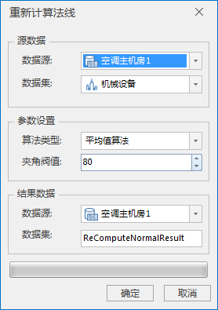

---
id: RecalculateNormal
title: 计算法线  
---  
### 使用说明

当模型数据集的法线不正确，同时模型不需要移除重复点或冗余点，可直接使用该功能重新计算模型法线。

### 操作步骤

  1. 打开需要重新计算法线的模型所在的数据源。
  2. 在“ **三维数据** ”选项卡上“ **模型** ”组中，单击“ **模型处理** ”下拉按钮，在弹出的下拉菜单中选择“ **计算法线** ”，弹出“重新计算法线”对话框，如下图所示：        
  
 
  3. 源数据选择。选择重新计算法线的模型所在的数据源和数据集。
      * 数据源：鼠标单击数据源右侧的下拉箭头进行选择。
      * 数据集：鼠标单击数据集右侧的下拉箭头进行选择。
  4. 设置法线计算参数，包括算法类型、夹角阀值。 
      * 算法类型：模型进行重新计算法线的算法，可选算法包括夹角权重算法、平均值算法、NelsonMax算法。鼠标单击算法类型选框的下拉箭头进行选择。
      * 夹角阀值：重建计算法线算法中涉及夹角阈值参数，阈值范围为0-180，默认为80，可自定义夹角阈值。
  5. 设置结果数据存储相关参数，包括数据源选择和数据集命名。 
      * 数据源：重新计算法线后的结果模型存储的数据源指定。鼠标单击数据源选框右侧的下拉箭头进行选择。
      * 数据集：结果数据集的名称命名，默认为ReComputeNormalResult，可自定义数据集名称。
  6. 鼠标单击“确定”按钮，根据所设定的参数重新计算法线，获得模型新的法线。

