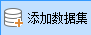

**使用说明**

　　拓扑校正是指批量将多个数据集中的模型对象的三角面校正为统一的方向并移除重复或无效三角面，涉及拓扑校正以及移除重复三角面的操作，校正拓扑错误，保证渲染效果。

**操作步骤**

1. 在工作空间管理器中右键单击“数据源”，选择“打开文件型数据源”，打开包含模型数据集的数据源。
2. 单击“ **三维数据** ”选项卡中“ **模型** ”组中" **模型校正** "下拉按钮，在弹出的下拉菜单中选择“ **拓扑校正** ”，弹出“拓扑校正”对话框。
3. 添加数据集：单击“添加数据集”按钮，在弹出的选择对话框中选择或新建模型数据集。
4. 另存结果数据集：设置是否将结果数据另存为结果数据集，默认勾选。若不勾选，则结果数据将会覆盖源数据。
5. 参数设置完成，单击“确定”，执行“拓扑校正”操作。
6. 在场景中查看拓扑校正模型对象的属性，在模型信息下可以看见三角面个数的改变。

 

