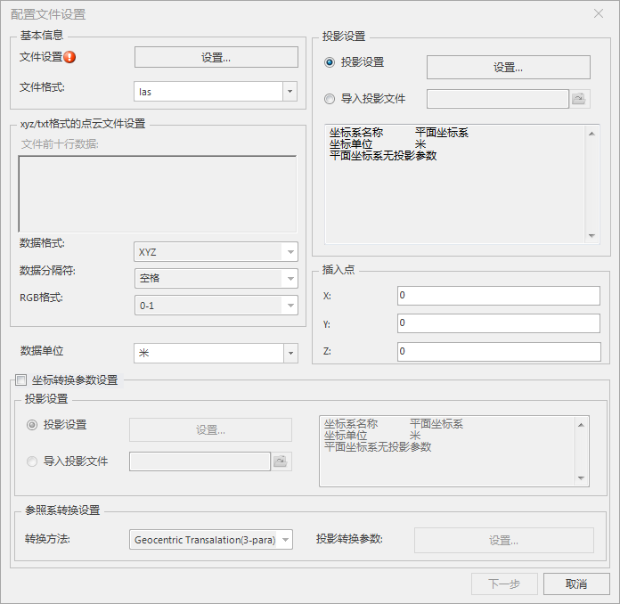

**使用说明**

　　“生成缓存”功能生成点云数据的三维切片缓存及SCP索引文件，方便在三维场景中加载该三维切片缓存，实现点云数据浏览。

**操作步骤**

　　在“ **三维数据** ”选项卡的“ **点云** ”组中,单击“ **生成缓存** ”按钮，弹出“配置文件设置”。

**配置文件设置**  
弹出的“配置文件设置”对话框如下所示，用户可以对配置文件的参数进行设置。   
  
 
  1. 文件设置：用于设置分组点云数据。单击“设置”按钮，弹出“导入分组点云数据-LAS”对话框后，设置点云数据的分组信息，如删除和添加分组，删除和添加文件，查看点云数据的源路径等。  
  分为左右两栏，左边为设置分组信息的，右边为设置具体文件信息。  
    * 左栏分别提供了“添加分组”、“添加文件夹，将文件夹下所有点云数据作为一个分组”、“添加文件夹，将文件夹下的下一级所有子文件夹作为分组”以及“删除”按钮。并且双击分组名称可以进行重命名操作。
    * 右栏分别提供了“添加文件”、“删除”以及“显示文件全路径”操作按钮。
  2. 文件格式：下拉选择当前点云数据的格式，目前支持las、txt、xyz、ply、laz五种格式的点云数据。 若选择las或ply或laz的文件格式，“xyz/txt格式的点云文件设置”不被激活。 若选择txt或xyz的文件格式，“xyz/txt格式的点云文件设置”被激活，需设置如下：  
    * **文件前十行数据** ：程序自动读取并显示源路径下点云文件的前十行文本；
    * **数据格式** ：下拉选择点云存储所采用的信息格式类型，支持以下常用的格式类型。 
      * **XYZ** ：采用XYZ坐标的格式。
      * **XYZ_Reflectance** ：采用XYZ坐标、反射强度的格式。
      * **XYZ_Reflectance_RGB** ：采用XYZ坐标、反射强度、颜色信息的格式。
      * **XYZ_Reflectance_RGB_Normal** ：采用XYZ坐标、反射强度、颜色信息、表面法向量的格式。
      * **XYZ_Reflectance_Normal_RGB** ：采用XYZ坐标、反射强度、表面法向量、颜色信息的格式。
      * **XYZ_RGB** ：采用XYZ坐标、颜色信息的格式。
      * **XYZ_RGB_Reflectance** ：采用XYZ坐标、颜色信息、反射强度的格式。
      * **XYZ_RGB_Normal** ：采用XYZ坐标、颜色信息、表面法向量的格式。
      * **XYZ_RGB_Reflectance_Normal** ：采用XYZ坐标、颜色信息、反射强度、表面法向量的格式。
      * **XYZ_RGB_Normal_Reflectance** ：采用XYZ坐标、颜色信息、表面法向量、反射强度的格式。
      * **XYZ_Normal** ：采用XYZ坐标、表面法向量的格式。
      * **XYZ_Normal_RGB** ：采用XYZ坐标、表面法向量、颜色信息的格式。
      * **XYZ_Normal_Reflectance_RGB** ：采用XYZ坐标、表面法向量、反射强度、颜色信息的格式。
      * **XYZ_Normal_RGB_Reflectance** ：采用XYZ坐标、表面法向量、颜色信息、反射强度的格式。
      * **UnKnown** ：除上面描述之外的格式。
    * **数据分隔符** ：下拉选择点云数据各信息之间的分隔符类型，选择项有以下： 
      * **空格** ：以空格“ ”作分隔符。
      * **逗号** ：以逗号“,”作分隔符。
      * **冒号** ：以冒号“:”作分隔符。
    * **RGB格式** ：下拉选择点云数据颜色值的表达范围类型，选择项有以下： 
      * **0-1** ：颜色值范围为0-1。
      * **1-255** ：颜色值范围为1-255。
  3. 数据单位：用于设置点云数据的单位，默认为米，可以通过数据单位右侧的下拉箭头选择其他数据单位。提供的备选数据单位有米、度、厘米、毫米、英寸、英尺。
  4. 投影设置：用于设置点云数据的投影信息，默认选择平面坐标系，可根据需求修改： 
    * **平面坐标系** ：默认选择平面坐标系。
    * **投影设置** ：选择“投影设置”单选框，单击右侧“设置...”按钮，即可在弹出的“投影设置”对话框中，选择程序提供的一种的投影，文本框中将显示所选投影的详细信息。
    * **导入投影文件** ：选择“导入投影文件”单选框，单击右侧“选择”按钮，在弹出的“选择”窗口中，选择投影信息文件（*.xml）并导入即可，此时，下方文本框中会显示所选投影文件的详细信息。
  5. 插入点：用于设置点云数据的模型参考点坐标，请分别设置X、Y、Z坐标值，默认的插入点为（0,0,0）。
  6. 若需要进行坐标转换，勾选“坐标转换参数设置”，激活目标坐标系和参数系转换设置处的控件。
    * 目标坐标系提供了两种设置方式，具体操作如下所述。设置好目标投影之后，右侧会显示目标投影的详细信息。 
      * **投影设置** ：选择“投影设置”单选框，单击  按钮，弹出“投影设置”窗口，设置目标投影。设置目标投影的具体操作，请参考[“投影设置”窗口](../../../DataProcessing/Projection/PrjCoordSysSettingWin  )。
      * **导入投影文件** ：选择“导入投影文件”单选框，单击其右侧的浏览按钮，在弹出的“选择”窗口中，选择投影信息文件并导入即可。支持导入 shape 投影信息文件（*.shp;*.prj）、MapInfo 交换格式（*.mif）、MapInfo TAB 文件（*.tab）、影像格式投影信息文件（*.tif;*.img;*.sit）、投影信息文件（*.xml）。
      * 选择转换方法：单击“转换方法”标签右侧的下拉按钮，弹出的下拉菜单列表显示了系统提供的十种参考系转换的方法，用户可选择一种合适的参考系转换方法。关于转换方法的说明，请参考[参照系转换方法说明](../../../DataProcessing/Projection/PrjConvertMethods  )，有关转换方法和适用范围请参考[转换模型](../../../DataProcessing/Projection/TransformationModel  )。
      * 设置投影转换参数：不同的转换方法，“投影转换参数设置”对话框中自定义的参数存在差异。 
        * 选择的为三参数转换法，如 Geocentric Transalation、Molodensky 或 Molodensky Abridged，则用户需要设置“投影转换参数设置”对话框中的三个平移参数，即（ΔX，ΔY，ΔZ）。此种转换实质上是一种地心变换，从一个基准面的中心（0,0,0）转换到另一个基准面中心（ΔX，ΔY，ΔZ）。三参数变换是线性的平移变换，单位为米。 
        * 如选择的七参数转换法，如为 Position Vector、Coordinate Frame 或 Bursa-wolf，则用户需要设置“投影转换参数设置”对话框中的七个参数，即三个线性平移参数（ΔX，ΔY，ΔZ）、绕轴旋转的三个角度参数（Rx，Ry，Rz）和比例差（S）。平移参数以米为单位；旋转参数以秒为单位，取值范围在[-60,60]之间；而比例差为百万分之一（ppm）。
  7. 设置完参数后，单击“ **下一步** ”，，弹出“点云生成缓存”对话框。  
**点云生成缓存**   
“点云生成缓存”对话框可以用于设置生成缓存文件的参数，具体如下所示：  
     1. 追加文件路径：勾选此项，实现在已有的点云缓存文件的基础上追加生成。若勾选则缓存路径和缓存名称不可设置，为已有文件的路径和名称。
     2. 缓存路径：单击“缓存路径”右侧按钮，在弹出的“浏览文件夹”对话框选择缓存文件的保存路径，单击“确定”按钮即可；也可在文本框中直接输入保存缓存文件路径。
     3. 缓存名称：输入字符串作为缓存的名称。
     4. 金字塔剖分类型：用于设置缓存切片创建树型金字塔的剖分类型。点云数量庞大，需要通过空间索引来建立合理的数据组织，以管理点云数据，程序提供了四叉树和八叉树两种方式。 
           * **四叉树** ：一种二维空间索引，根节点按照空间范围被划分为四个子区域而形成四个子节点。四叉树适用于平面范围大、高度上差值较小而不需要高度层级剖分的空间范围，如城市级别的建筑。
           * **八叉树** ：八叉树是四叉树在三维空间的自然延伸，以空间内的一个点为基准将空间划分为八个区域而形成八个子树。八叉树适用于高度上值很大、平面范围较小的空间范围，如一栋高楼。
     5. 特征值：用于后期进行分层设色的属性字段，有高度、强度与类别三种特征值。单击右侧按钮，在下拉菜单中选择配置文件中含有的特征值。
     6. 文件类型：提供S3M，S3MB，OSGB三种文件类型。
     7. 生成类别：设置需要生成缓存的类别ID，可以根据需求输入多个类别ID，ID之间用分号“；”隔开，中英文分号均可。
     8. 瓦片剖分类型：设置生成瓦片的剖分方式，默认为全球剖分。
     9. 设置层级：勾选此项，进行层级设置。分别输入开始层和结束层，开始层不得大于结束层。
     10. 设置完以上参数后，单击“确定”按钮，即可执行点云生成缓存的操作。  
若文件类型选择S3MB，则生成完成后，在指定缓存路径下产生一个与缓存名称命名的文件夹，文件夹中包含一个*.SCP索引文件，以及多个存有*.s3mb模型文件的文件夹，其结果如下图所示：

  

生成缓存后，在三维场景中可通过“添加三维切片缓存图层”的方式加载和浏览点云数据。

 

