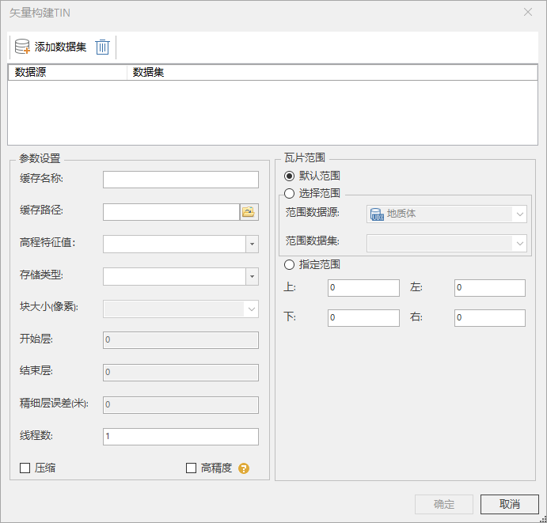

---
id: GeoTIN
title: 矢量构建TIN缓存  
---  
### 使用说明

TIN（不规则三角网）是针对连续三维空间的不规则划分，其最小单元为不规则三角形。

该功能通过三维点数据集或等值线数据集模拟三角网构建TIN缓存。

### 操作步骤

  1. 在“ **三维数据** ”选项卡的“ **TIN地形** ”组中的" **TIN工具** "下拉按钮中，单击“ **矢量构建TIN**”按钮，弹出“矢量构建TIN”对话框。  
  
 
  2. **源数据** ：
      * **数据源** ：选择需要进行构建TIN的矢量数据集所在数据源。
      * **数据集** ：选择需要进行构建TIN的矢量数据集。
      * **场景类型** ：系统根据矢量数据投影信息自动生成场景类型。
  3. **参数设置** ： 
      * **缓存名称** ：输入字符串做为TIN缓存名称。
      * **缓存路径** ：设置 TIN缓存文件保存路径，单击右侧文件浏览按钮，选择文件保存路径，或者在文本框中直接输入保存路径。
      * **高程特征值** ：是指矢量数据集的高程值，支持通过下拉菜单选择字段设置为点数据集的高程特征值。
      * **存储类型** :系统提供了3种缓存类型，紧凑、原始和块存储。
        * 紧凑表示采用一定的压缩和加密机制，在建立缓存时对数据进行压缩和加密。
        * 原始表示不对数据进行压缩，保留原始信息。
        * 块存储表示将数据存储在固定长度的块中。当矢量数据为线数据集时，存储类型仅支持原始类型存储。当TIN缓存类型为块存储时，不支持低版本兼容。
      * **开始层、结束层** ：自动获取层编号，开始层和结束层均可修改，支持的修改范围为自动获取的层编号之间。
      * **精细层误差** ：直接在文本框内输入误差数值，单位为米。
      * **线程数** ：设置分配给生成TIN缓存的线程数，默认为1。
      * **压缩** ：若勾选压缩，则把每个TIN缓存文件内部的数据流进行zip压缩，默认勾选。
      * **高精度** ：仅高精度的DEM数据支持改操作。
      * **瓦片范围**：对“缓存范围”区域进行设置，有以下两种方式： 

        * 勾选“默认范围”复选框，默认采用数据集的范围，左上右下四个文本框显示了系统默认范围； 
        * 不勾选“默认范围”复选框，用户可自定义范围。有两种方式，一种是通过选择范围数据集，取选择的数据集的范围；另一种是直接在左上右下四个文本框中输入范围值。
  4. 单击确定，生成TIN缓存，其中，*.sct是缓存配置文件。

