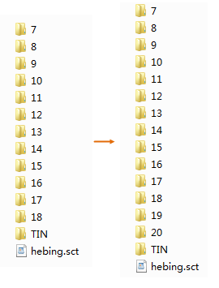

---
id: SubdivideTIN
title: 细分TIN缓存  
---  
### 使用说明

“细分TIN缓存”功能是将TIN缓存继续细分。

### 操作步骤

1. 在“ **三维数据** ”选项卡的“ **TIN地形** ”组中的" **TIN工具** "下拉按钮中，单击“ **细分** ”按钮，弹出“细分TIN缓存”对话框。
2. **源配置文件** ：选择需要进行细分的TIN地形配置文件（*sct)。
3. **精细层级** ：自动获取源配置文件的层级。
4. **细分层数** ：设置继续细分的层数。
5. 单击确定，即可执行细分TIN缓存，其中，*.sct是缓存配置文件。

本案例数据，源配置文件的结束层为18，设置细分层数为2，则继续细分两层，结果数据的结束层级为20。

  

