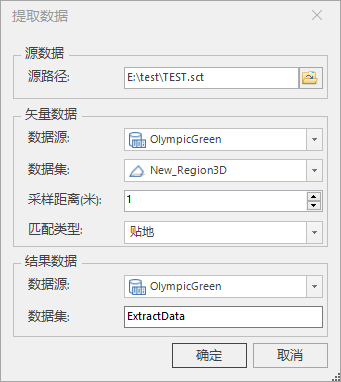

**使用说明**

　　“TIN提取数据”是获取点、线、面在指定TIN地形上的高程值，支持二维点、线、面和三维点、线、面。

**操作步骤**

  1. 在工作空间管理器中右键单击“ **数据源** ”，选择 “ **打开文件型数据源** ”，打开包含点、线、面数据集的数据源。以二维点为例。
  2. 在“ **三维数据** ”选项卡的“ **TIN地形** ”组中，单击““ **提取三维数据** ”按钮，弹出“提取数据”对话框，如下图所示：  
    
  3. 源数据选择：鼠标单击源路径右侧打开文件路径按钮，在弹出的“打开”对话框中选择TIN缓存的模型配置文件（*.sct），单击“打开”即可；也可在文本框中直接输入配置文件所在的文件夹路径及名称。
  4. 矢量数据设置，包括数据源和数据集选择。 
    * 数据源：鼠标单击右侧下拉按钮，在弹出的下拉列表中选择点数据所在的数据源。
    * 数据集：鼠标单击右侧下拉按钮，在弹出的下拉列表中选择点数据集。
    * 采样距离：设置提取数据的采样距离，单位为米，默认值为1.可直接输入数值或通过右侧上下箭头调整数值。
  5. 设置提取的点数据的存储路径，包括数据源和数据集。 
    * 数据源：鼠标单击右侧下拉按钮，在弹出的下拉列表中选择提取的点数据将存储到的数据源。
    * 数据集：输入提取的点数据存储名称，默认为ExtractData。
  6. 设置完以上参数后，单击“确定”按钮，即执行在TIN地形上提取的点数据的高程值。
  7. 打开提取的点数据和TIN地形，效果如下。  
       
 
**注意事项**

 1. 工作空间中必须有打开的数据源。
 2. 对于二维点、线、面，执行另存为操作，是将二维点、线、面转为三维点、线、面。
 3. 暂不支持TIN混合文件上的数据提取。

 

