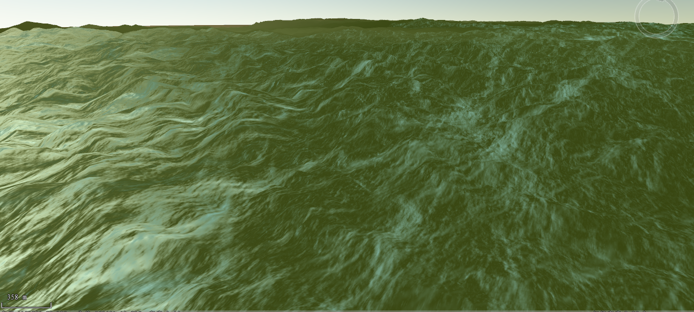

---
id: TINBuildWaterMask
title: TIN叠加海洋  
---  
### 使用说明

根据精确的海岸线范围生成带海洋边界的Tin缓存,在TIN地形范围内指定矢量范围作为海洋效果的叠加区域。用矢量面构建地图，黑色代表陆地，白色代表海洋，然后生成全球剖分的三维缓存。三维缓存范围要和Tin地形的范围保持一致。

### 操作步骤

1. 在“ **三维数据** ”选项卡的“ **TIN地形** ”组中的" **TIN工具** "下拉按钮中，单击“TIN叠加海洋”按钮，如下图所示，并弹出“Tin叠加海洋”对话框。 
   

2. 选择叠加区域的Tin地形缓存（文件格式*.sct）。
3. 选择叠加区域的矢量面，需要打开面数据集所在的数据源。
4. 作为陆地多边形：加载的矢量面区域不作用海洋水体效果，仍为陆地。
5. 输入结果数据的目标路径，并且创建缓存名称。点击“确定”按钮，生成指定区域内带海洋水体效果的Tin地形缓存。
6. 将结果数据添加到场景中，打开场景属性面板，勾选“海洋水体”。
  

7. 在场景中就能观看到海洋水体效果。下图显示了不勾选和勾选“作为陆地多边形”两种效果图：  
    
  
  
  
### 注意事项

1. 指定矢量面范围与TIN地形范围要保持一致。

