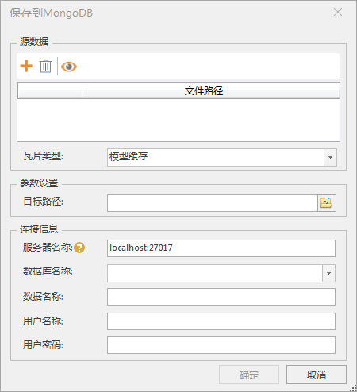

**使用说明**

　　“保存到MongoDB”功能可根据源 *.sct 文件，将其关联的TIN地形数据保存到 MongoDB 数据库中。通过该功能将TIN地形数据保存到MongoDB 之后，便于数据分享与发布。只要能连接到TIN地形数据所在的 MongoDB 服务器，共享 *.sct配置文件后，通过*.sct文件即可浏览或处理TIN数据。

**操作步骤**

  1. 在“ **三维数据** ”选项卡的“ **TIN地形** ”组中的“ **数据升级** ”下拉按钮中，单击“ **保存到MongoDB** ”按钮，弹出“TIN数据保存到MongoDB”对话框，如下图所示。
    
  2. 单击源数据处“源配置文件”组合框中单击右侧的“打开”按钮，在弹出的“打开”对话框中选择TIN地形配置文件。
  3. 在参数设置处“组合因子”后的文本框内输入参数n设置块大小，块大小为4n。
  4. 对话框中的“连接信息”区域可设置 MongoDB 服务器和数据库的相关信息，在使用该功能前，需先启动 MongoDB 服务，有关MongoDB 请参看“[MongDB 使用说明](../../../TechDocument/MongoDBDatabaseGuide)”。有关参数说明如下：    
       * **服务器名称** ：输入 MongoDB 数据库服务器名称，或输入服务器的 IP 地址。输入格式为服务器地址：端口。
       * **数据库名称** ：设置TIN地形数据需要保存到的 MongoDB 数据库名称。若服务器是以非用户验证方式启动 MongoDB，则可单击下拉按钮选择服务器中已存在的数据库，或直接输入新数据库名称创建一个数据库；若服务器以用户验证方式启动 MongoDB，则不支持新建数据库，也不能读取到已有的数据库名称，只能在文本框中输入已存在数据库名称。
       * **数据名称** ：用于设置和显示TIN地形数据在 MongoDB 数据库中的保存名称。
       * **用户名称** ：输入MongoDB数据库的用户名称，若为新建的数据库，则设置其用户名。
       * **用户密码** ：输入进入 MongoDB 数据库的密码，若为新建的数据库，则对其设置密码。
  5. 设置完以上参数后，单击“确定”按钮，即可执行TIN地形缓存数据保存到 MongoDB 数据库的操作。

 

