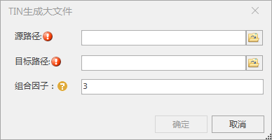

**使用说明**

　　为了进一步提升TIN地形的加载浏览效率，程序提供“升级成大文件”功能，可以将存储在多个文件夹下的诸多碎文件生成为一个大文件。

**操作步骤**

1. 在“ **三维数据** ”选项卡的“ **TIN地形** ”组中的“ **数据升级** ”下拉按钮中，单击“ **升级成大文件** ”按钮，弹出“TIN生成大文件”对话框。  
    
2. 源路径：单击右侧按钮，在弹出的“打开”对话框中选择待生成大文件的配置文件，单击“打开”即可；也可在文本框中直接输入配置文件所在的文件夹路径及名称。
3. 目标路径：单击右侧按钮，在弹出的“浏览文件夹”对话框中设置大文件数据保存的路径，单击“确定”按钮；也可在文本框中直接输入文件夹路径。
4. 组合因子：支持输入参数n设置块大小，块大小为4n。
5. 设置完以上参数后，单击“确定”按钮，即可执行模型生成大文件操作。

生成功后，在目标文件夹下生成了一份新的TIN地形缓存文件。

 

