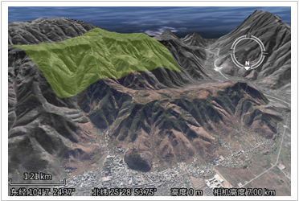
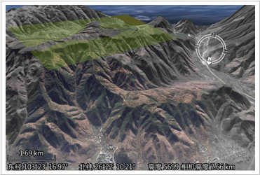
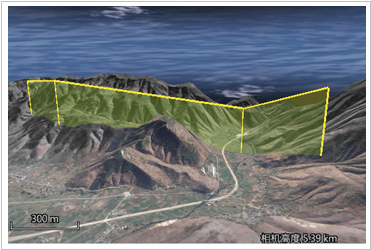
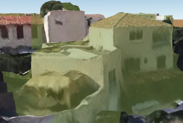
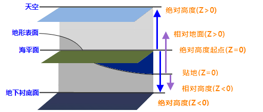

---
id: AboutAltitudeMode
title: 关于高度模式  
---  
按照数据来源的不同，可以分为地上数据和地下数据。下面详细介绍这两种数据各自不同的高度模式：

**地上数据**

1. **贴地高度模式(ClampToGround)**

     当使用贴地高度模式（ClampToGround）时，三维数据的海拔高度会完全被忽略，各个三维对象依据其经纬度和地形表面的起伏状态附着在地形表面，即相对于地形表面的高度为零。如下图所示，使用贴地高度模式(ClampToGround)时，面对象的海拔高度信息则被忽略了，面对象将依据经纬度坐标信息，依地形起伏的趋势附着在高低起伏的地形表面。    
    
  
 **需要注意** ：贴地模式下为默认的高度模式，在此模式下不可以设置数据来自于地上或者地下。

2. **绝对高度模式(Absolute)**

    绝对高度模式(Absolute)下的海拔高度值是相对于海平面的海拔高度，该模式忽略地形的实际海拔高度，当知道精确的海拔高度值时，这种高度模式非常有用。如下图所示，场景中的一个面对象，该面对象边界节点的高程值均为5800米，在使用绝对高度模式(Absolute)时，该面对象的显示状态如下所示。  
  

3. **相对地面高度模式(RelativeToGround)**

    相对地面高度模式(RelativeToGround)下的海拔高度值是以经纬度坐标值正下方的地平面（地形表面）为基准的海拔高度。如下图所示，场景中一个拉起的线对象，线对象的各个节点的高程值相等，则在相对地面高度模式下，其显示状态如下所示。  
    
 
4. **贴对象高度模式(ClampToObject)**

    当使用贴对象高度模式(ClampToObject)时，矢量数据会随着模型数据的起伏，完全贴附至模型数据上，即相对于模型数据的高度为零。如下图所示，使用贴对象高度模式时，面对象的海拔高度信息则被忽略了，面对象将依据模型的起伏的趋势附着在模型数据表面。贴对象高度模式常应用于倾斜摄影模型场景中。  
    

5. **修改地形高度模式(ModifyTerrain)**

    修改地形高度模式(ModifyTerrain)主要用于修改矢量面区域的地形，若地形和模型匹配得不好，可以通过修改地形把部分地形压低或抬高来达到与模型匹配好的效果。当使用修改地形高度模式时，矢量面当前位置的地形高度，会根据矢量面自身的底部高程值来抬高或者压低当前的地形。

**地下数据**

1. **相对地下高度模式(RelativeToUnderground)**

    当使用相对地下高度模式(RelativeToUnderground)时，底部高程值可以为负值，即几何对象或者模型对象可放置于地表以下，主要用于地下场景的浏览，如地下管线和海底等应用场景是非常有用的。如将高度模式设置为相对地下模式，地表高程设置为-100，则该几何对象将位于地表以下100米处，基准面为地形表面。

2. **地下绝对高度模式(AbsoluteUnderGround)**

    地下绝对高度模式(AbsoluteUnderGround)下的海拔高度值是相对于海平面的海拔高度，将忽略地形的实际海拔高度。相对地下模式对于地下管线和海底等应用场景是非常有用的。计算高程时以球面为基准，不受地形影响。当高度模式为此种模式时，位于地下的对象可以通过调节地表透明度或者挖方实现地下对象的可见。

    下图给出了不同高度模式对应的基准面以及高度值（Z值）设置后对应的几何对象所放置的高度区域，由下图可知，绝对高度模式的海拔高度基准面为海平面，正方向与下图中箭头方向一致；贴地模式下，对象将附着在地形表面，相对地面、相对地下高度模式的海拔高度基准面为地形面，正方向与下图中箭头方向一致。  
    

  
### 备注

矢量数据集类型的三维图层高度的设置，请参见[设置底部高程和拉伸高度](SettingHeight)，通过“底部高程”标签右侧的组合框来设置字段值或手动输入图层的锚点高程值。

