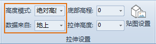

---
id: AltitudeModeSetting
title: 设置高度模式  
---  
“ **风格设置** ”选项卡的“ **拉伸设置** ”组，用于设置矢量数据集类型的三维图层的高度模式。

  

  
### 高度模式的设置方法

1. 将要设置高度模式的矢量数据集类型的三维图层设置为当前图层。场景中默认的高度模式为贴地模式。
2. 当设置高度模式为非贴地时，选择数据类型来自于地上或者地下。
3. 通过“拉伸模式”组中的“高度模式”组合框设置选中的矢量数据集类型的三维图层的高度模式，组合框的下拉列表中列举了所支持的高度模式（相对地面或者绝对高度），用户可以根据需要选择来设置高度模式。有关多种高度模式的介绍，请参见[关于高度模式](./AboutAltitudeMode)。

### 注意事项

1. 只有当当前图层为矢量数据集类型的三维图层，且“风格设置”选项卡 >“拉伸设置”组中的高度模式设置为非贴地模式时，“拉伸设置”组中的各功能控件才可使用，各项设置才有效。

