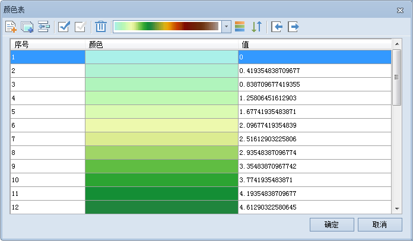

---
id: ColorTable3D
title: 设置栅格图层的颜色表  
---  
### 使用说明

通过设置场景中栅格数据集的颜色表，可修改三维栅格数据集中各象元的颜色。

### 操作步骤

1. 在当前场景中加载栅格数据集，且需作为影像数据加载到场景中。
2. 在图层管理器中，右键单击不同图层结点下的栅格数据集，在弹出的右键菜单中选择“设置颜色表”项。将弹出如下图所示的“编辑颜色表”对话框。      

3. 用户可通过该对话框设置栅格图层的颜色方案，或设置某个像元值所使用的颜色；也可通过添加新的像元值或者删除部分像元值来调整栅格数据的颜色显示方案。有关颜色表设置的详细说明，请参见[颜色表设置对话框](../../Visualization/VisualSetting/ColorTableDia)。

