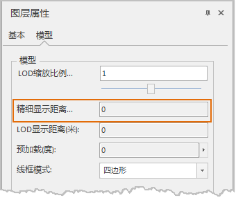

“ **场景图层属性** ”面板“ **模型** ”组的“ **精细显示距离** ”属性，用来对矢量模型缓存中的模型精细显示的距离进行设置。

  
  
“精细显示距离”用来设置矢量模型缓存精细显示的距离。如 CAD 模型数据集生成的场景缓存为矢量模型缓存。 **注意：仅对矢量模型缓存图层起作用**
。应用程序默认的精细显示的距离值为200米。

对于近处（观察距离小于等于精细显示距离）的模型采取精细模型效果显示，远处（观察距离大于精细显示距离）的模型则采取简单模型显示。这项技术将有利于合理地进行模型渲染的资源分配，达到高效率的场景显示。

 

