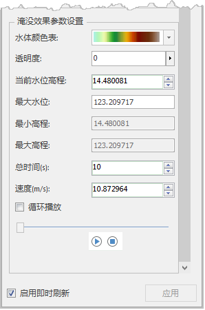
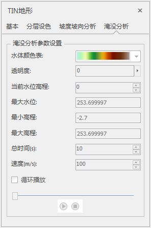
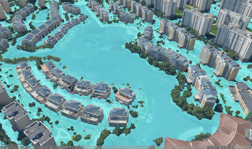

水淹分析是三维分析的一个重要方向，基于地形信息，它可以确定洪水淹没的范围、水深以及洪水在地理空间上的演进过程。目前，平台对倾斜摄影模型、TIN地形数据提供了展示淹没效果的功能，可实时模拟积水随时间变化的动态进展，从而快速判断内涝对交通、财产、人身可能造成的伤害。

在“图层管理器”中选择倾斜摄影模型图层，右键单击“图层属性”选项，弹出“图层属性”面板；对于TIN地形数据，右键单击“属性”弹出“TIN地形”面板。面板下方具有如下图的“淹没效果参数设置”的区域，可对水体、淹没水位及淹没速度等进行设置。

 
  

  
  1. **水体颜色表** ：点击右侧颜色下拉框，选择水体的颜色方案。
  2. **透明度** ：点击右侧按钮弹出设置水体透明度的滑块，滑动滑块调节；也可直接输入0-100的数字。默认透明度为 0，表示水体完全不透明；随着数值增大，水体会变得越来越透明；最大值为 100，表示完全透明。
  3. **当前水位高程** ：直接输入数字或点击“增加”“减少”的按钮调节当前水文高程。
  4. **最大水位** ：输入数字表示水体淹没的最大高程。
  5.  **最小高程** ：此参数为自动获取且不可更改，为当前图层的高程最小值。
  6.  **最大高程** ：此参数为自动获取且不可更改，为当前图层的高程最大值。
  7.  **总时间(s)** ：用于显示和设置水体从最小高程淹没到最大水位所需时间，单位为：秒。调整总时间，速度数值将发生变化。
  8.  **速度(m/s)** ：用来显示和设置水体从最小高程淹没到最大水位的速度，单位为：m/s。调整速度，总时间将发生变化。
  9.  **播放控件** ：通过“开始”、“暂停”或“停止播放”按钮控制水体淹没模型的状态。
  10. **循环播放** ：勾选该复选框后，在模拟水体淹没时，将重复执行播放操作，直到用户停止播放；若未选中该复选框，则在播放完毕后自动停止。  
  
  
 

