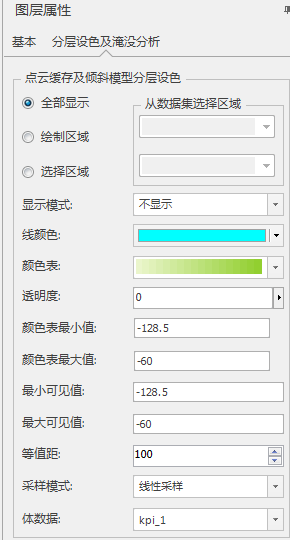
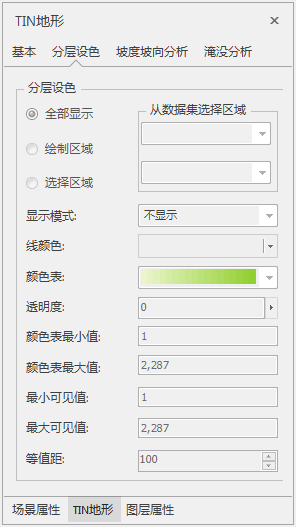
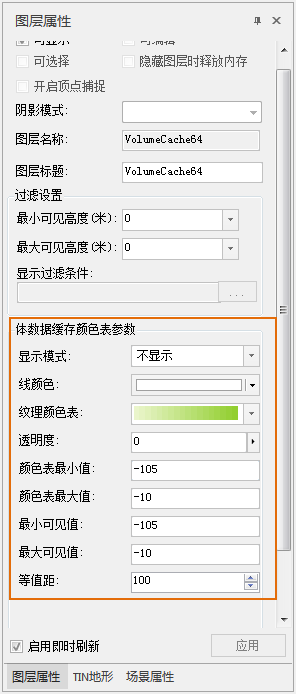
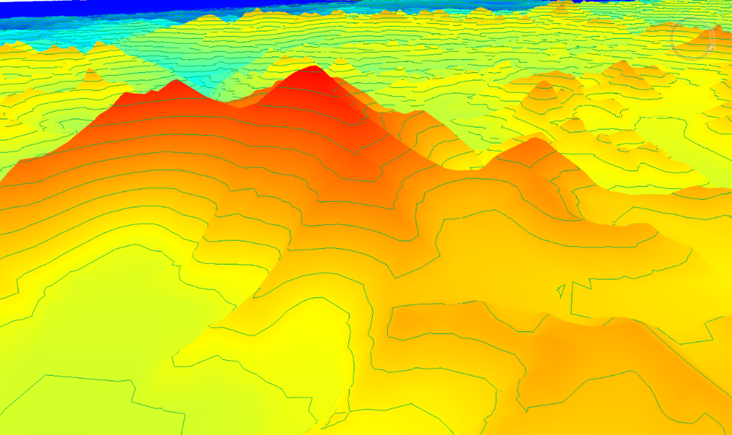

分层设色是地图可视化的常用方式，它通过一定的颜色变化次序或色调深浅来表达和区别三维数据的不同属性。平台支持对模型数据集、倾斜摄影模型、点云三维切片缓存（osgb）数据、TIN地形设置颜色表、透明度、显示区域、最大/最小可见值等参数，实现模型的分层设色表达；另外支持三维栅格体数据设置颜色表。

选择模型图层，右键单击“图层属性”选项，将根据图层类型的不同显示略有区别的属性面板，如下图，从左至右依次为点云缓存与倾斜摄影模型、TIN地形、模型数据集与栅格体数据的属性面板。

 
 
  
 
  1.  **显示区域** ：点云缓存、倾斜摄影模型与TIN地形设置分层设色时，可自定义区域。
        * **全部显示** ：默认为“全部显示”，即该图层模型全部参与分层设色表达。
        * **区域显示** ：勾选此项后，将鼠标移至场景区域时变为编辑划线状态，可在模型上点击勾绘一个多边形区域，表示该多边形区域内的模型显示分层设色，区域外不显示分层设色。
        * **选择区域** ：勾选此项后，激活“从数据集选择区域”的下拉框，选择当前工作空间打开的数据源、面/三维面数据集。当面数据集有多个多边形时，“SmID”数值最小的多边形显示分层设色，其他多边形不起作用。
  2.  **显示模式** ：提供了不显示、线填充、面填充、线面填充四种模式，点击右侧下拉框选择。
        * **不显示** ：默认不显示，即不进行分层设色表达。 
        * **线填充** ：采用显示等值线的方式进行分层设色表达。
        * **面填充** ：采用面填充的方式进行分层设色表达。
        * **线面填充** ：采用等值线与面填充的方式进行分层设色表达。 
  3.  **线颜色** ：点击右侧颜色下拉框，选择等值线的颜色方案。
  4.  **纹理颜色表** ：点击右侧颜色下拉框，选择填充面的颜色方案。 
  5.  **透明度** ：点击右侧按钮弹出设置水体透明度的滑块，滑动滑块调节；也可直接输入0-100的数字。默认透明度为 0，表示水体完全不透明；随着数值增大，水体会变得越来越透明；最大值为 100，表示完全透明。
  6.  **颜色表最小值** ：输入数字，用于设置纹理颜色表最左侧颜色所对应的高程/点云强度值，默认为模型高程/点云强度值的最小值。 
  7.  **颜色表最大值** ：输入数字，用于设置纹理颜色表最右侧颜色所对应的高程/点云强度值，默认为模型高程/点云强度值的最小值。
  8.  **最小可见值** ：输入数字，用于设置参与分层设色表达的模型高程/点云强度值的最小值，默认为模型高程/点云强度值的最小值。小于该值的模型将不显示分层设色。
  9.  **最大可见值** ：输入数字，用于设置参与分层设色表达的模型高程/点云强度值的最大值，默认为模型高程/点云强度值的最大值。大于该值的模型将不显示分层设色。
  10. **等值距** ：输入数字，用于设置等值线的间距，默认值为100米，表示每隔100米绘一条等值线。  

