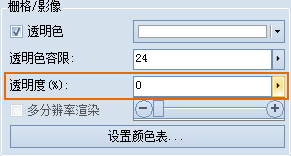

### 透明度

透明度是图层的显示属性，可以通过“ **场景图层属性** ”面板上的“ **栅格/影像** ”组中的“ **透明度** ”命令进行设置。

“透明度(%):”标签右侧的按钮用来设置当前图层的透明程度。

单击该按钮，弹出图层透明度设置的滑块（如下图所示），用户可滑动滑块调整图层透明度，或者直接输入透明度值，实时浏览设置结果。

默认透明度的数值为 0，表示图层完全不透明，随着数值的增大图层会变得越来越透明；当透明度的数值设为 100 时，图层完全透明。透明度数值的范围为 0 至
100 之间的整数。

  

  
**备注**

仅当选中场景中打开的影像图层或作为影像加载的栅格图层，图层透明度设置按钮方可用。

 

