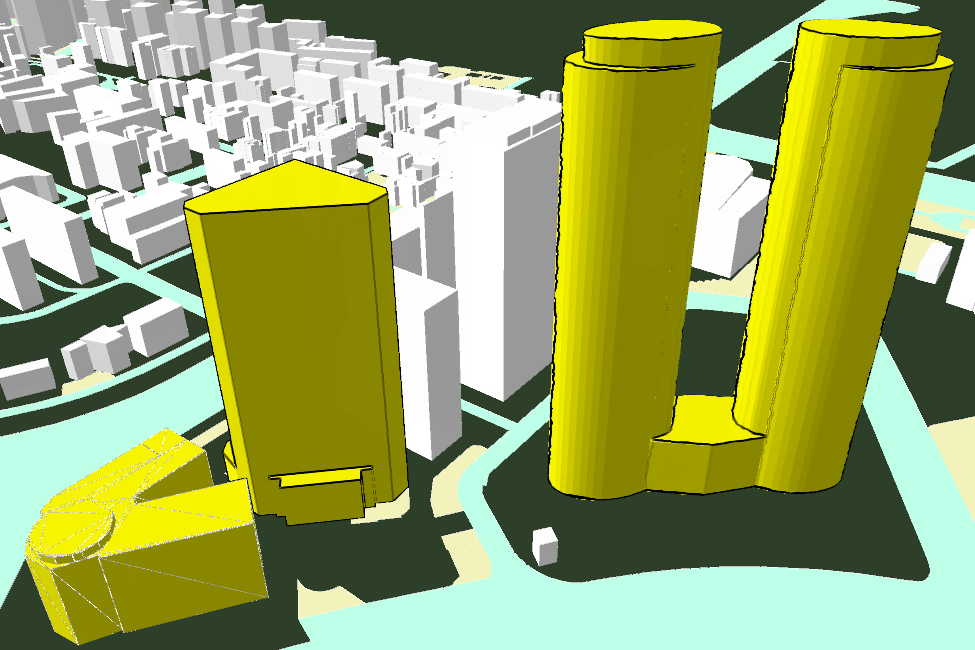

---
id: ModelDisplayMode
title: 模型显示模式  
---  
只有模型数据集和模型缓存数据在 **风格设置** 中设置 **填充风格** 为“ **轮廓** ”或者“ **填充与轮廓** ”时，模型的线框模式才起作用

在模型数据集或模型缓存数据的图层属性“ **模型** ”选项卡中，选择“ **线框模式** ”更改模型轮廓显示方式，包括“ **三角形** ”模式、“
**四边形** ”模式和“ **草图** ”模式三种显示。

三角形模式显示模型最原始的三角网形式，保留原有所有细节。

四边形模式和草图模式只显示了模型形状，草图模式模型边缘较粗糙  

  
---  
模型线框模式，从左到右分别为三角形、四边形、草图模式  
  
### 操作步骤

1. 在当前场景中存在模型数据集或模型缓存数据时，选中其所在图层为当前图层。
2. 在“ **风格设置** ”选项卡的“ **填充风格** ”模块，设置填充模式为“ **轮廓** ”或者“ **填充与轮廓** ”
3. 单击“ **场景** ”选项卡的“ **属性** ”组中的“ **图层属性** ”按钮，弹出“ **图层属性** ”面板。
4. 在面板的“ **模型** ”中，可以通过更改线框模式选项修改模型的轮廓模式。

