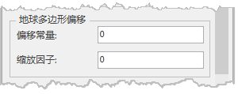

---
id: PolygonOffset
title: 多边形偏移  
---  
多边形偏移是解决场景中图层重叠发生闪烁问题的有效办法，平台支持对场景、三维面图层、三维切片缓存（osgb）图层及模型数据集图层设置多边形偏移，在图层属性面板下，如下图：

  

  
### 多边形偏移参数

1. **偏移常量** ：获取或设置多边形偏移常量。当值为正值时，表示多边形朝屏幕外偏移；为负值时，表示多边形朝屏幕内偏移。
2. **缩放因子** ：多边形偏移常量和多边形偏移深度斜率因子共同决定了多边形对象在屏幕深度方向的偏移量，设置多边形偏移常量和多边形偏移深度斜率因子，可用于解决多边形重叠时闪烁的问题。
多边形偏移常量和缩放因子共同决定了多边形对象在屏幕深度方向的偏移量，有如下公式：

深度偏移量=m**x**缩放因子+r**x**偏移常量

其中，m为多边形的最大缩放因子；r为确保场景坐标深度值能够被区分的最小值，它是随OpenGL渲染而异的常量。

如下图模型因为贴地球表面，所以产生闪烁现象。设置模型多边形偏移的偏移因子为5后，可以发现闪烁现象消失了。     
    
  

