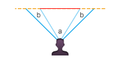
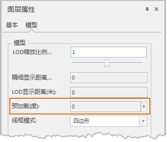

---
id: PreLoadRange
title: 设置预加载范围  
---  
### 使用说明

“ **场景图层属性** ”面板上“ **模型** ”组中的“ **预加载（度）** ”属性，用来对矢量模型缓存显示的加载范围行设置。

设置预加载范围后，场景会以（2*预加载范围 + 场景相机视角）为夹角建立一个新的视景体，从而增大模型的加载范围；在预加载范围内的模型在场景漫游时会更加流畅。  

  
  
其中，a 角为场景相机的视角。场景相机的视角指场景中相机的范围（如图，人眼睛可视范围或者显示器屏幕的范围），取值范围为[0-180]。b
角为场景中设置的预加载范围。视景体是指成像景物（模型）在空间的集合，如示意图中的视景体角度为
a+2b。在场景显示的时候视景体外多余的部分被裁减掉，只显示视景体内的有关内容。

### 操作步骤

1. 点击功能区>“ **场景** ”选项卡>“ **数据** ”组>“ **缓存** ”按钮或“ **缓存** ”的下拉按钮“ **加载缓存...** ”；或者右键点击图层管理器中“ **普通图层** ”结点，并选择右键菜单中的“ **添加矢量缓存...** ”项。
2. 在“ **场景图层属性** ”面板的“ **模型** ”组中，单击“ **预加载（度）** ”标签后的文本编辑框，输入要预加载范围的度数；或者单击文本框后的下拉箭头，弹出滑动条，直接拖动滑块即可完成设置。预加载范围的单位为度，取值范围为[0-90]。  
  

