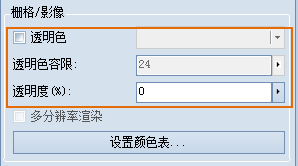

---
id: Rastergroup3D
title: 处理场景中栅格/影像图层  
---  
“ **场景图层属性** ”面板中的“ **栅格/影像** ”组中组织了栅格和影像图层的透明色相关属性设置的功能控件。其中，“ **透明色**
”复选框仅在当前图层为栅格/影像图层时才可用。  

  

  
 [透明度](LayerTransparent)

 [透明色设置](TransparentColor)

 [多分辨率渲染](MultiResolution)

