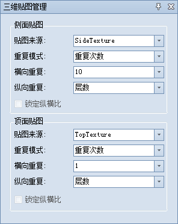

---
id: SettingTexture
title: 设置对象表面贴图  
---  
对场景中的对象使用贴图进行渲染，可以增加场景的真实性。“ **风格设置** ”选项卡的“ **拉伸设置** ”组中的“ **贴图设置**
”按钮用来对三维图层中的几何对象的表面贴图进行设置。

注意：只有当前图层为矢量数据集类型的三维图层时，且“风格设置”选项卡 > “拉伸设置”组中的高度模式设置为非贴地模式时，才能激活“贴图设置”按钮。  

  
 
  
### 侧面贴图（顶面贴图）参数设置：

* 贴图来源：贴图文件的位置。有2种设置方式，一是直接选择贴图文件所在的路径，并指定贴图文件；二是选择包含贴图文件路径信息的字段，获取贴图文件。如果需要给所有对象设置同样的贴图，请使用第一种方式；如想对不同的对象设置不同的贴图，请使用选择字段的方式。需要用户事先对属性表中编辑好每个对象要使用的贴图所在的路径。
* 重复模式：提供了2种重复模式，重复次数和实际大小。 

**重复次数** 即贴图重复放置的次数，分为横向重复次数和纵向重复次数。

**实际大小** 指按照指定的尺寸大小进行贴图，分为横向大小和纵向大小。

* 横向重复：贴图文件在横向重复的次数。重复次数可以直接输入正整数指定，也可以通过选择保存重复次数信息的字段确定。
* 纵向重复：贴图文件在纵向重复的次数。重复次数可以直接输入正整数指定，也可以通过选择保存重复次数信息的字段确定。
* 横向大小：贴图文件按照指定的尺寸大小进行显示，即贴图文件在横向的实际尺寸，单位为米。既可以输入数值，也可以从字段中读取。
* 纵向大小：贴图文件按照指定的尺寸大小进行显示，即贴图文件在纵向的实际尺寸，单位为米。既可以输入数值，也可以从字段中读取。
* 锁定纵横比：原始横向和 纵向的值比例。当勾选该项时，即锁定纵横比时，将保持横向和纵向比例不变，当其中一项发生改变时，另一个值会根据需要改变以保持形状；不勾选该项时，即解锁纵横比时，不再保持原图片比例，会对图片进行适当的拉伸。

### 操作步骤：

1. 在“ **风格设置** ”选项卡的“ **拉伸设置** ”组中，单击“ **高度模式** ”右侧的下拉箭头，修改高度模式为非贴地模式，即绝对高度、相对地面或者相对地下模式之一，此时激活“贴图设置”按钮。
2. 单击“贴图设置”按钮，进入“三维贴图管理”窗口。
3. 在“三维贴图管理”窗口中，设置侧面贴图参数。
4. 在“三维贴图管理”窗口中，设置顶面贴图参数。

### 注意事项

* 只有当当前图层为矢量数据集类型的三维图层，且“ **风格设置** ”选项卡 > “ **拉伸设置** ”组中的高度模式设置为非贴地模式时，“拉伸设置”组中的各功能控件才可使用，各项设置才有效。三维图层中的对象进行垂直拉伸后，将变为三维体对象，通过扩展设置可以对其的顶面和侧面进行贴图。
* 若当前工作空间未保存，则设置的贴图字段必须要使用绝对路径，才可显示贴图纹理；若当前工作空间已保存，则设置的侧面贴图和顶部贴图的字段属性值可为相对路径，也可为绝对路径。其中，相对路径为工作空间与贴图文件保存位置之间的相对路径。

###  相关主题

[纹理贴图](../DataProcessing/Attention5_WallImage)

[专题图子项贴图设置](../SceneVisualization/Thematic3DTexture)

