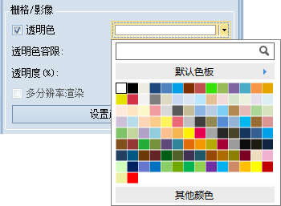

**使用说明**

透明色设置用来将场景中栅格/影像图层中某种颜色设置为透明色，即将影像中指定颜色覆盖的区域设置为透明效果。 完成透明色的设置需要将“ **透明色** ”和“
**透明色容限** ”两个命令配合使用。

**操作步骤**

1. 选择将要设置透明色的栅格/影像图层为当前图层。
2. 单击“ **场景** ”选项卡“ **属性** ”组中的“ **图层属性** ”按钮，弹出“ **场景图层属性** ”设置面板。
3. 在“ **栅格/影像** ”组中，通过勾选“ **透明色** ”复选框来启用影像图层的透明色设置，同时，“透明色”复选框右侧的颜色按钮变为可用状态。
4. 点击透明色颜色设置下拉按钮，指定影像图层中透明效果的颜色。  
  

5. 设置透明色容限，用户可使用滑块来调整透明色容限值，或者直接输入数值，透明色容限的数值为 0-255之间的整数。
6. 设置完成后，该影像图层将实时显示设置之后的效果。

 

