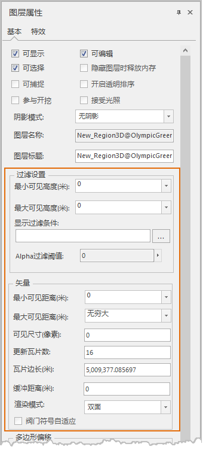

“ **图层属性** ”面板上的“ **过滤设置** ”和“ **矢量** ”组，可用于控制场景中图层的可显示范围。

  

  * **可见高度**
    * **最小可见高度** ：显示和设置当前观测点距离三维图层中对象的最小可见高程值。如果场景中当前观测点的高程值小于该高程值时，该三维图层中的模型对象将不可见。单位为米。
    * **最大可见高度** ：显示和设置当前观测点距离三维图层中对象的最大可见高程值。如果场景中当前观测点的高程值大于该高程值时，该三维图层中的模型对象将不可见。单位为米。
  * **可见距离**
    * **最小可见距离** ：显示和设置当前观测点距离三维图层中模型对象的最小可见距离值。如果场景中当前观测点的距离值小于该距离值时，该三维图层中模型对象将不可见。单位为米。
    * **最大可见距离** ：显示和设置当前观测点距离三维图层中模型对象的最大可见距离值。如果场景中当前观测点的距离值大于该距离值时，该三维图层中模型对象将不可见（默认无穷大）。单位为米。
  * **可见尺寸**
    * **可见尺寸** ：显示和设置当前三维图层中模型对象的最小可见像素值。如果场景中模型对象的显示像素值小于该像素值时，该三维图层中模型对象将不可见。单位为像素。

注意，以上三类参数的设置都可通过其标签右侧的组合框进行设置，用户可以输入适当的数值，也可以选择下拉列表中的"设置为当前高度"项，将当前场景中观测点的高程值作为相应的数值。选择下拉列表中的"清除"项，即可清除当前的设置并恢复为默认设置。此外需要注意，只有三维场景中模型图层才能设置可见距离和可见尺寸参数。

  * **更新瓦片数**
    * **更新瓦片数** ：支持设置缓存数据和矢量数据的更新瓦片数。更新瓦片数是指场景渲染缓存和矢量图层时，每次刷新瓦片数的多少，该值越大，缓存和矢量图层渲染速度越快，但同时也会消耗更多的硬件资源，建议用户根据自身机器配置来选择该属性的大小。若图层管理器中选中的是矢量缓存图层或矢量数据集图层时，即可在“更新瓦片数”文本框中输入场景渲染图层时的更新瓦片数，默认值为16，即每次刷新的瓦片数为16×16。
    * **瓦片边长（米）** ：显示和设置瓦片边长的大小，单位为米。若在“图层管理器”中选中的是矢量图层，则支持设置瓦片边长；若在“图层管理器”中选中的为缓存图层时，会显示缓存的瓦片边长大小，不支持设置。
  * **显示过滤条件** ：用来设置当前矢量图层的显示过滤条件，过滤图层中哪些对象可显示哪些对象不可显示，便于用户根据需要显示感兴趣的要素，过滤掉暂时不需要显示的要素。

单击“显示过滤条件”按钮，弹出如上图所示的对话框，用户可以直接在“过滤条件”标签后的文本框中输入 SQL 表达式作为过滤条件，单击 Enter（回车）键即可应用图层的过滤条件，使图层中满足过滤条件的对象不可见。此外，用户也可单击文本框右侧的 
按钮，在弹出的“SQL 表达式”对话框中构建过滤表达式，设置完成后单击“确定”按钮即可应用图层的过滤条件，使图层中满足过滤条件的对象可见。SQL表达式的使用和构建方法请参见：[SQL 表达式对话框](../../Query/SQLDia  )。

  * **Alpha过滤阈值** ：低于Alpha过滤阈值的对象不显示。

 

