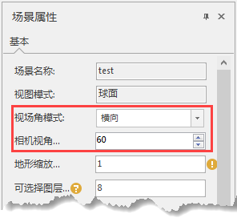

---
id: AngelAdjustment
title: 调整相机视角  
---  
在场景中进行操作时，需要通过特定的视角才能全面的浏览场景中的对象，比如在地面上仰视一座大厦，或者俯视地下某一段管线。场景中相机的倾斜角可以通过按住鼠标滚轮滚动进行调节。

SuperMap 场景默认为普通视角方式显示浏览，普通视角方式是使得场景中的某一点（屏幕中心点）绕穿过 Z 轴上该点（该点为地球表面与 Z 轴的交点）与 X
轴平行的直线进行旋转。

在实际的操作过程中，可以通过按住鼠标滚轮同时上下拖动鼠标使场景中的画面沿着屏幕中心点在0-90度范围内运动。调整相机视角时，屏幕中心点的经纬度坐标与调整是没有变化的。
普通视角方式的原理。

“ **场景属性** ”面板上的“ **相机视角** ”，可用于调整场景的相机视角范围。

  
 
  
**视场角模式** ：场景相机视角设置支持横向或纵向，两种视口大小调整模式。

**相机视角**
：相机视角主要是用来控制显示屏的视角范围，视角越小显示窗口范围相对越小，同时看到远处越清晰，相机视角越大显示窗口范围相对越大，但是看到远处越模糊 。

此处数值用户可以选择系统缺省的几个参考值，也可以手动设置自己需要的数值，但是数值应控制在0度到180度之间，但不包括0度和180度。

###  相关主题

 [查看/设置场景属性](Option)

