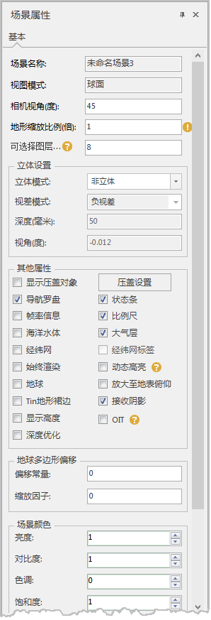

---
id: Option
title: 查看/设置三维场景属性  
---  
### 使用说明

“ **场景** ”选项卡上的“ **场景属性** ”命令，可以用来查看或设置当前场景的属性。

当修改面板上的参数时，场景效果将跟着设置的属性值发生变化。

### 操作步骤

  1. 打开要查看或设置属性的场景。
  2. 在 **“场景”** 选项卡上的 “ **属性** ”组中，单击“ **场景属性** ”按钮，弹出“ **场景属性** ”面板，如图所示。    
  
 

###  相关主题

 [调整相机视角](AngelAdjustment)

 [可选择图层数](OptionalLayersNumber)

[地表显示模式](../../SceneOperation/AdvancedSceneSetting/Surface)

[立体显示模式](../../SceneOperation/AdvancedSceneSetting/Vectorgraph)

[场景要素显示](../../SceneOperation/AdvancedSceneSetting/PropertyGroup)

[场景颜色](../../SceneOperation/AdvancedSceneSetting/SceneColor)

[地球多边形偏移](../../SceneOperation/AdvancedLayserSetting/PolygonOffset)

