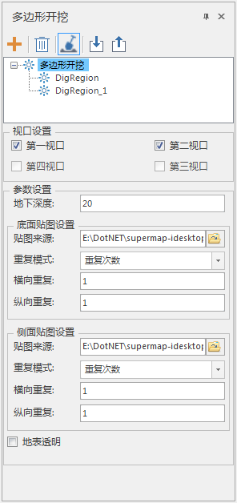
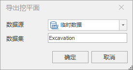
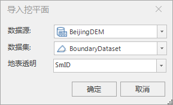

---
id: PolygonExcavation
title: 多边形开挖  
---  
### 使用说明

用来在场景中的地球表面进行挖方，并计算挖方体积。支持多视口开挖，支持导入导出开挖面。

### 操作步骤

  1. 在使用多边形开挖功能之前，请先设置好合适的面积单位。设置方式同通过“ **三维分析** ”选项卡的“ **量算** ”组中的“面积单位”标签右侧的组合框进行面积单位的设置。具体操作为：
     * 单击“ **三维分析** ”选项卡中“ **量算** ”组中“单位”按钮，弹出“单位设置”对话框。用户选择需要的单位作为量算面积的单位即可。默认的面积单位为：平方米。
  2. 开启多边形开挖功能。在“ **场景** ”选项卡的“ **地下** ”组中，单击“开启/关闭”标签右侧的下拉按钮，选择“开启”项，启用多边形开挖功能。默认情况下，多边形开挖功能是关闭的。
  3. 鼠标单击“ **开挖** ”下拉按钮，在弹出的下拉菜单中选择“ **多边形开挖** ” 。弹出“多边形开挖”面板。如图所示。   
  

  4. 开挖面确定：单击“参与开挖”按钮，将鼠标移动到场景窗口中，鼠标改变状态后，即可在场景中的地球表面进行绘制要开挖的地表面积大小。
  5. 在适当的位置连续单击鼠标左键，绘制多边形圈定要量算的开挖范围。当确定多边形的两个或者两个以上的节点后，移动鼠标，当前鼠标点即可与已经确定的点构成一个临时面域，并且这个临时面域随着鼠标的移动而变化，单击鼠标右键结束绘制。
  6. 开挖面绘制结束后，会在面板的开挖面列表中增加一个相应的节点。
  7. 单击对应开挖面前的可编辑按钮，可以在面板进行参数设置。
      * **地下深度:** 用来设置地下可见深度。深度大于该数值的地下物体将不会显示。
      * **侧面贴图设置：** 用来设置开挖后侧面贴图的图片来源、重复模式、横向/纵向重复次数或者大小等。默认使用[安装路径]\Bin\Resource\excavationregion_side.jpg 进行填充。
      * **底面贴图设置：** 用来设置开挖后底面贴图的图片来源、重复模式、横向/纵向重复次数或者大小等。默认使用[安装路径]\Bin\Resource\excavationregion_top.jpg 进行填充。
      * **地表透明：** 用来设置开挖区域是使用默认图片填充还是透明显示。勾选“地表透明”复选框时，填充设置参数均不可用，表示不使用任何填充，对开挖区域进行透明显示；不选择“地表透明”复选框时，使用对话框中设置的参数对挖方区域进行填充显示。
      * **倾斜摄影图层参与开挖：** 用于设置场景中的倾斜摄影图层是否参与地表开挖操作。选择该按钮表示场景中的倾斜摄影图层会被开挖；不选该按钮，则表示若场景中有倾斜摄影图层，在地表开挖时将不会被开挖。
  8. 相机高度为正值（要求相机高度小于10 千米时可见）时，该区域范围内的地下效果可见。同时，单击选中开挖面输出窗口中也显示出多边形开挖面积大小。
  9. 若需要继续进行多边形开挖操作，重复第 1 步至第 7 步的操作。
  10. 单击面板中的“删除节点”会将当前所选地表开挖面删除。
  11. 单击“清除”按钮 ，即可清除当前场景窗口中所有挖方面积的结果，同时，相机高度为正值时，进行“多边形开挖”区域范围内的地下效果不可见。
  12. 导出:单击“导出”按钮。弹出“导出开挖面”对话框，如图所示。选择开挖面的数据源与命名数据集，数据集默认名为Excavation，可自定义命名。    
  

  13. 导入：单击“导入”按钮。弹出“导入开挖面”对话框，如图所示。设置导入的开挖面的数据源、数据集以及地标透明的属性字段。  
  

### 注意事项

  1. 配合 **场景** ”选项卡内的“ **视口管理** ”中的视口模式可以对面板中的视口设置区域进行选择开挖视口实现多视口开挖。
  2. 当倾斜摄影图层参与开挖时，针对选择开挖面时可能会存在无法直接选中的问题，可以通过隐藏倾斜摄影图层再行选择或者对开挖面图层进行图层偏移等方法解决。

