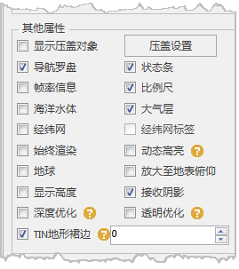

通过“ **场景** ”选项卡上“ **属性** ”组中的“ **场景属性** ”按钮弹出的“ **场景属性** ”面板，组织了对场景窗口中某些要素的显示。

  
  
下面将详细介绍各场景要素的功能与用法：

  * **显示压盖对象**  
当场景中的文本对象较多，且当前比例尺较小时，场景中的文本对象可能会出现相互压盖现象。若不勾选“显示压盖对象”复选框，则系统会根据文本对象在场景上的压盖情况，自动过滤掉后输入的文本对象，
从而避免压盖现象出现。若选择“显示被压盖对象”复选框，则当场景中文本对象出现压盖现象时，不进行过滤处理，显示全部文本对象。  
**压盖设置** ：点击“压盖设置”按钮，对压盖范围进行设置。当两个对象的距离大于该距离值，则显示此对象；小于或等于该数值，则不显示。
显示压盖对象的功能不仅适用于场景中的文本对象，还适用于三维专题图中的专题元素，即当专题元素之间出现压盖现象时，也可通过该复选框控制是否进行处理。

  * **导航罗盘**  
场景窗口的右侧区域为场景窗口的导航罗盘，导航罗盘主要用来对场景进行浏览控制，包括对场景进行放大、缩小、旋转、拉平竖起等操作。若勾选“导航罗盘”复选框，则显示导航罗盘，否则不显示。

  * **状态条**  
场景窗口的底部为场景窗口的状态条，用来显示场景窗口中当前鼠标点的坐标值（经纬度坐标）、当前鼠标点的高程值以及相机高度。若勾选“状态条”复选框，则显示状态条，否则不显示。

  * **帧率信息**  
用来控制是否在场景中显示帧率统计信息。选中该属性对应的复选框，表示在场景中显示帧率信息；否则将关闭帧率信息在场景中的显示。  
显示的帧率信息包括：
    * **平均帧率** ：当前场景显示刷新的平均帧率。帧率是用于测量帧数的度量值，其测量单位为每秒显示的帧数（Frames per Second，简称 FPS）。平均帧率越大，场景浏览越流畅。
    * **最好帧率** ：场景可显示的最大帧率。
    * **最差帧率** ：场景可显示的最小帧率。
    * **三角面数量** ：当前场景中显示的要素的三角面的数目。

  * **比例尺**  
用来显示场景窗口中当前的比例尺。若勾“比例尺”复选框，则显示比例尺，否则不显示。

  * **海洋水体**  
用来控制是否显示场景中模拟地球上海洋水体的流动效果。当相机高度低于800km时，若勾选“海洋水体”复选框，则显示海洋水体的流动效果，否则不显示。

  * **大气层**  
场景窗口中，在球体外围还有模拟地球所处的周围环境要素，大气层就是其中之一，以增强真实感。若勾选“大气层”复选框，则显示大气层，否则不显示。

  * **经纬网**  
用来控制是否显示场景中模拟地球的经纬网。若勾选“经纬网”复选框，则显示经纬网，否则不显示。  
如果选中了“经纬网”复选框，则“经纬网标签”复选框变为可用状态，用来控制经纬网的经纬度文字信息是否可显示。

  * **始终渲染**  
用来控制当当前场景失去焦点时，是否继续实时渲染该矢量图层。当选择“始终渲染”复选框时，表示场景失去焦点后继续实时渲染；不选择该属性时，失去焦点后立即停止实时渲染。

  * **动态高亮**  
当场景中加载了三维切片缓存图层时，勾选“动态高亮”，鼠标在场景中移动，当鼠标移动到某个模型上，此模型对象高亮。
动态高亮功能适用于三维切片缓存图层，不适用于倾斜摄影模型。

  * **地球**  
用来控制是否在场景中显示地球。

  * **接收栅格体数据**  
场景开启接收体数据集，实现栅格体数据渲染显示。在场景中添加栅格体数据缓存（*.scvo）图层后，若要查看栅格体数据渲染效果，需要勾选“接收栅格体数据”复选框，否则不显示栅格体数据。

  * **Tin地形裙边**  
当TIN地形存在裂缝时，开启“Tin地形裙边”可避免显示地形裂缝，从而提升TIN地形的显示效果。

  * **放大至地表俯仰**
用来设置场景放大至地表时，是否执行俯仰操作，能更大程度的提升用户的体验。

  * **接受阴影**  
勾选“接受光阴影”复选框，可以使当前场景接受阴影。

  * **显示高度**  
用来控制是否显示当前鼠标点的高程值。配合状态条一起使用，在勾选“状态条”复选框的情况下，勾选“显示高度”复选框，则显示当前鼠标点的高程值，若不勾选“显示高度”复选框，则高度显示为0。只勾选“显示高度”而不勾选“状态条”，不会显示高度。

  * **透明优化**  
开启透明优化来优化透明排序，勾选“透明优化”复选框后，图层顺序不影响透明效果。

  * **深度优化**  
用于提高深度精度，解决接近重叠但并不重叠的模型面远处看会闪烁的问题。开启深度优化前需将安装目录下Bin文件夹中的SuperMap。xml的IsRenderSceneWithTextureBuffer参数设置为true。

**注意事项**

若当前场景为平面场景，则不支持显示海洋水体、大气层、经纬网、经纬网标签这几个要素。

 

