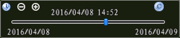
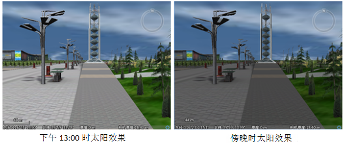

**使用说明**

在“ **场景** ”选项卡上的“ **浏览** ”组中，单击“ **可见** ”按钮，可以开启太阳特效，模拟真实场景中太阳光照的显示效果，单击“
**轨迹** ”按钮用来设置太阳特效的轨迹，支持设置太阳轨迹控件位置。

**操作步骤**

  1. 开启太阳特效。 
       * 单击“ **浏览** ”组的“ **可见** ”项，即可启用太阳特效的显示和设置。激活太阳特效后，图标将由  变成 。
       * 在当前工作空间中存在场景时，默认启用太阳特效。再次单击“ **可见** ”按钮，即可取消太阳特效。
  2. 单击“ **浏览** ”组的“ **轨迹** ”按钮，场景中会弹出太阳特效管理的滑块，可以对太阳光照的显示方式进行设置，修改阳光在地面的移动轨迹。注意，只有启用太阳特效，即激活“可见”按钮，“三维太阳特效管理”界面的各项参数才可以设置。  
  
 
     * 在场景中鼠标右键，选择右键菜单中的“属性”，打开场景属性面板。场景属性面板底部提供“太阳轨迹位置”参数设置入口（如下图），更改X和Y值（像素），即能修改太阳轨迹控件位置。    
        

     * “缩小”/"放大"按钮：单击该按钮可降低/提高时间滑块轴上的精确度，即将时间滑块的时间区间调大/调小。例如：当前滑块的的时间区间为一小时，单击"缩小"按钮，即可将滑块的时间区间调成一天，再单击该按钮，即可将滑块的时间区间调成一周。连续点击，可以在分钟、小时、天、年这些时间单位之间进行切换。 
     * “重置”按钮：单击按钮，即可将场景中太阳光照的时间切换至现在的时间。
  3. 拖动滑块轴中的滑块，可调整当前场景的时间。

不同时间太阳光照效果不同，如下图所示：

  

 

