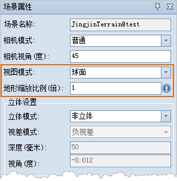

“ **场景属性** ”面板，提供了关于三维场景中地表显示的相关设置功能，主要包括三维视图模式和地形缩放比例两部分。

  
  
### 视图模式

  * **球面** ：以模拟地球的球体三维空间形式对地球表层的场景进行展示。
  * **平面** ：使地球球面展开成平面，模拟整个大地类似一个平面的形式进行场景展示。平面模式最好在场景比较小的时候使用，例如小区全景、楼盘展示或油田井架等大型设备。

### 地形缩放比例

“地形缩放比例”右侧的组合框用来设置当前场景中地形数据的垂直夸张程度。

具体操作：用户可以通过单击下拉按钮，选择下拉列表中给定的数值，也可以在组合框中直接输入适当的数值。地形缩放比例的数值单位为倍，即对地形数据垂直放大的倍数。

“地形缩放比例”为1时，表示不对地形数据进行缩放的原始状态；当设置大于1的数值时，表示对地形的垂直比例进行放大，即夸张地形的起伏度，从而更为直观地展示模拟地球表面的地形状况。

**注意** ：若用户需在三维场景中进行地形的可视性或可视域分析，仅在“地形缩放比例”为1的情况下进行分析，才能保证结果正确。

**相关主题**

 [查看/设置场景属性](Option)

 

