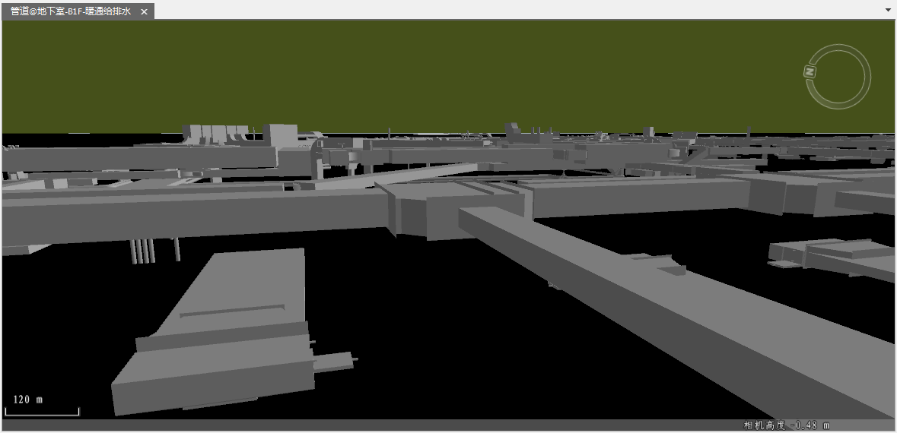
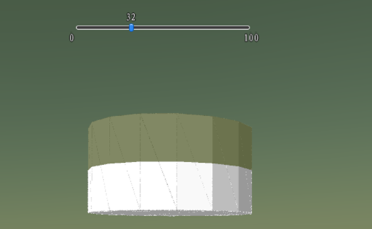
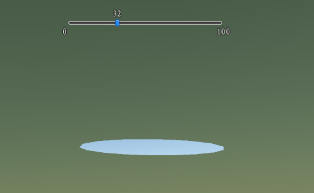

---
id: Underground
title: 地下显示  
---  
“ **场景** ”选项卡上的“ **地下** ”组，提供了地下模式显示。在三维场景开启地下模式，可以对地表以下的场景进行浏览与操作。

### 开启/关闭地下模式

开启地下模式后三维球上的地下场景可见，否则不可见。此外，地下模式只有在加载地下数据情况下才有效果。开启地下模型，示例效果如下：

  
 
  
### 可见深度

“可见深度”用于控制地下数据的显示范围。

“可见深度”只有在开启地下模式的情况下才可进行设置。默认值为1000，表示从地球表面至地下1000米之间的数据将会显示在当前场景中。

### 地下颜色

开启地下模式后，可用于设置地下场景的显示颜色，单击“地下颜色”右侧按钮，在弹出的颜色面板中设置颜色。

### 透明度

“透明度”只有在开启地下模式的情况下才可进行设置。单击该按钮，在场景窗口中弹出透明度设置滑块。用户可使用滑块来调整地表的透明度，设置的透明效果将在地图上实时显示。透明度的数值范围为0到100之间的整数，地表透明度的数值越大，地表的透明程度越高，100
代表完全透明，0 代表完全不透明。

### 开挖

“开挖”地下数据提供[多边形开挖](PolygonExcavation)与闭合模型开挖。

### 闭合模型开挖

用来在场景中的地球表面进行挖方，挖去选中的闭合模型。操作步骤如下：

  1. 在使用闭合模型开挖功能之前，确保场景中存在闭合模型。
  2. 开启闭合模型开挖功能。在“ **场景** ”选项卡的“ **地下** ”组中，单击“开启/关闭”标签右侧的下拉按钮，选择“开启”项，启用闭合模型开挖功能。默认情况下，闭合模型开挖功能是关闭的。
  3. 鼠标选中需要开挖的闭合模型，然后鼠标单击“ **开挖** ”下拉按钮，在弹出的下拉菜单中选择“ **闭合模型开挖** ” ，实时显示开挖后的结果。闭合模型示例开挖前后对比图如下：     
   
 
  4. 若需要继续进行闭合模型开挖操作，重复第 1 步至第 3步的操作。
  5. 单击“清除”按钮 ，即可清除当前场景窗口中所有挖方面积的结果，同时，相机高度为正值时，进行“闭合模型开挖”区域范围内的地下效果不可见。

### 注意事项

  1. 在场景中开挖，只能在地球表面量算，在地球以外的场景窗口的其他区域，开挖无效。
  2. 进行开挖时，开挖面积值的计算方式与面积量算的计算方式相同，即为需要显示的地表面积。

