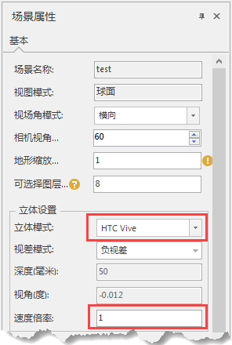

---
id: Vectorgraph
title: 立体显示  
---  
### 使用说明

立体效果显示原理：人以左右眼看同样的对象，两眼所见角度不同，在视网膜上形成的像并不完全相同，这两个像经过大脑综合以后就能区分物体的前后、远近。从而产生立体视觉。立体成像的原理即为通过一组设备实现左右眼睛分别各获取一组画面，经过大脑神经反应从而产生立体效果。

将非立体模式切换到其它立体显示模式下，即打开相应3D立体显示效果。

  * 3D立体显示：激活3D立体显示效果并配合相应设备，可以使用户观看三维场景的时候有身临其境的感觉。 

**立体模式：**

  * 非立体：普通三维场景模式。
  * 互补色立体：通过红蓝滤色设备显示出的立体效果。
  * 四缓存式立体：通过四缓存分频显卡及快门眼镜获取图像方式实现立体效果。
  * 水平跨越式立体：通过两台设备左右分别投影，再利用偏振式滤光原理实现的立体成像效果。
  * 垂直跨越式立体：通过两台设备上下分别投影，再利用偏振式滤光原理实现的立体成像效果。
  * OculusVR： 通过佩戴Oculus VR虚拟头盔设备，体验沉浸式的场景效果。
  * HTC Vive：支持连接HTC Vive虚拟现实头盔。

注意：使用OculusVR/HTC Vive模式，需要将场景的行走模式设置为“键盘驱动”、“自动行走”、“自动奔跑”中的一种，并且开启碰撞检测。

**视差模式：**

  * 正视差：正视差模式下实现显示物体向屏幕里纵深的效果，主要通过调节 **"视角"** （单位弧度）和 **"深度"** （单位毫米）参数来调节场景表现的视觉距离感。
  * 负视差：负视差模式下实现显示物体向屏幕外凸显的效果，通过设置 **"深度"** （单位毫米）参数调节场景表现的视觉距离感。   
   

**速度倍率：**

  * 当立体模式为HTC Vive时可以设置此参数，用于控制HTC手柄速度。

### 备注

负视差下视角不可调节，正视差下关于深度参数的调节对视觉距离感的影响非常小。

深度参数调节范围-1000~1000。

###  相关主题

 [查看/设置场景属性](Option)

[立体显示技术原理](../../TechDocument/Stereo/StereoTheory)

[解决方案](../../TechDocument/Stereo/StereoSolutions)

