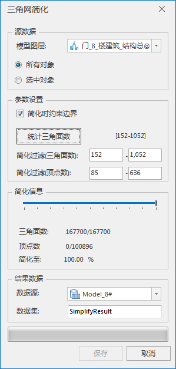
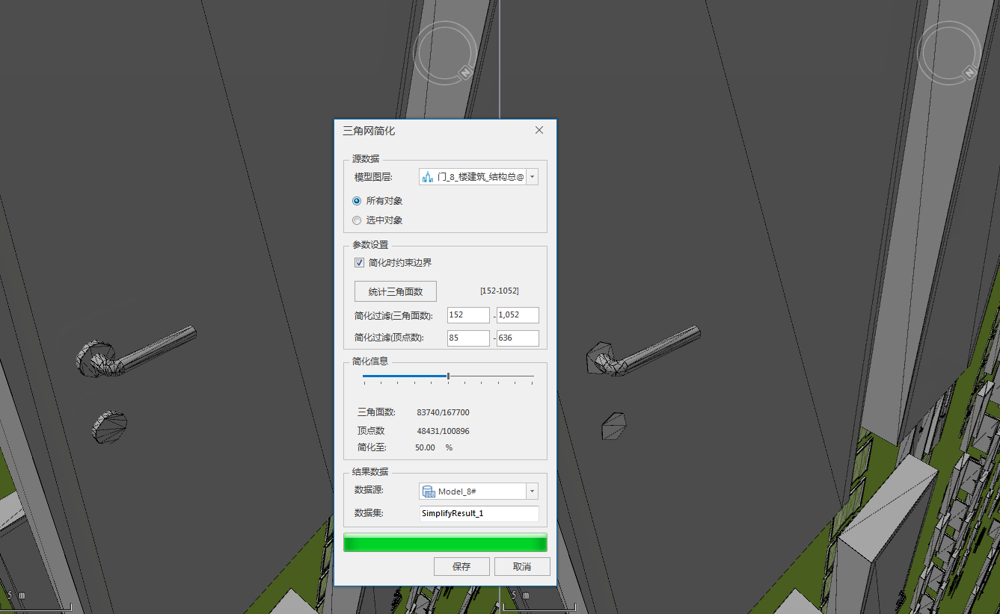

---
id: BIMSimplify
title: 三角网简化  
---  
### 使用说明

BIM是一种高密度模型，它精准、详尽地展示了建筑物内、外部的模型，其数据量惊人，从而导致BIM模型的三维场景性能有待提高。某些BIM模型存在大量冗余的三角面，如桥梁墩柱、门把手、锁芯等。使用BIM三角网简化功能，实现对图层中所有模型对象或选中模型对象的三角网进行简化，降低内存的占用，满足大体量数据的性能需要。

### 操作步骤

  1. 在工作空间管理器中右键单击“数据源”，选择 “打开文件型数据源”，打开包含BIM模型数据集的数据源。
  2. 选择模型数据集，右键点击“添加到新球面场景”，在图层管理器中选中模型图层，右键单击“快速定位到本图层”。
  3. 单击“ **三维地理设计** ”选项卡中“ **模型操作** ”组中“ **模型编辑** ”下拉按钮，在弹出的下拉菜单中选择“三角网简化”，弹出“三角网简化”对话框，如下图所示：         
  
 
  4. 设置源数据相关参数。在源数据组中，通过模型图层右侧的下拉箭头选择模型对象所在的图层，然后单选简化对象是所有对象还是选中对象。 
      * 所有对象：图层的所有模型对象都将进行简化操作。
      * 选中对象：图层中仅被选中的模型将进行简化操作。勾选此项需确保场景中已有模型对象被选中，“鼠标左键+Shift”能在场景中选择多个模型对象。
  5. 设置简化参数和简化信息，具体如下： 
      * 简化时约束边界：默认勾选，表示简化时需要保持边界不变形。当需要同步简化模型边界时，取消勾选复选框。
      * 简化过滤(三角面数)：鼠标单击“统计三角面数”按钮，统计模型包含的各个子对象的三角面数，最终统计结果实时显示在右侧的[ ]里，显示了指定模型对象的三角面片数范围。在简化过滤（三角面数）后的文本框内输入进行三角网简化操作的三角面数范围，筛选的三角面数量范围要在统计结果区间内才能参与简化操作。
      * 简化过滤(顶点数)：鼠标单击“统计三角面数”按钮后，会同时统计模型包含的各个子对象的顶点数，最终统计结果实时显示在右侧的[ ]里，显示了指定模型对象的顶点数范围。在简化过滤（顶点数）后的文本框内输入进行三角网简化操作的顶点数范围，筛选的顶点数量范围要在统计结果区间内才能参与简化操作。
      * 简化信息：鼠标滑动刻度条设置简化率，简化三角面片数。每次改变刻度值都会对选中的模型图层进行简化，简化信息组中的三角面数和简化的百分比数值实时计算显示，同时在第二视口可预览简化后的效果，如下图所示：         
  

  6. 设置结果数据存储相关参数，包括数据源选择和数据集命名。 
      * 数据源：简化后的结果模型存储的数据源指定。鼠标单击数据源右侧的下拉箭头进行选择。
      * 数据集：结果数据集的名称命名，默认为SimplifyResult，可自定义数据集名称。
  7. 鼠标单击“保存”按钮，进行BIM模型简化结果存储，集在指定的结果数据源下生成一个模型数据集。

### 注意事项

  1. 更换模型图层后，需要鼠标单击“统计三角面数”按钮，刷新简化条件的信息。
  2. 每简化一次，在工作空间下的临时数据源下，都会保留场景中第二视口显示的简化效果数据。

