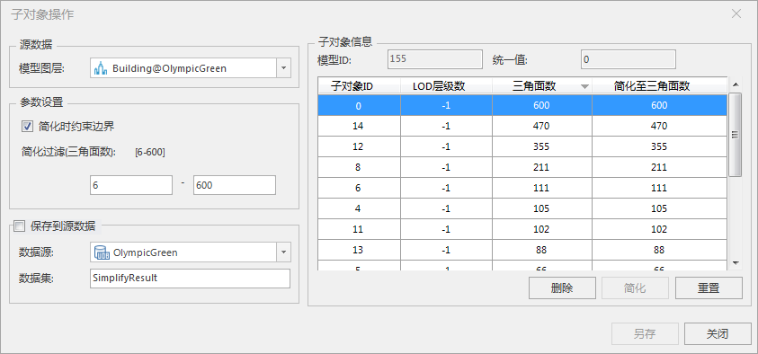
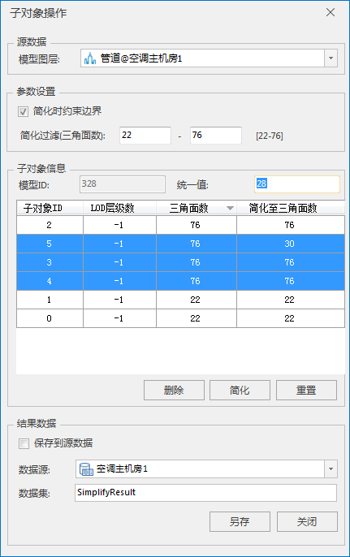
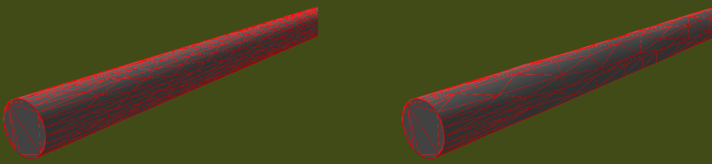

---
id: BIMSkeletonSimplify
title: 操作子对象  
---  
### 使用说明

操作子对象是对模型对象包含的子对象进行操作，操作涉及删除子对象和简化子对象。

### 操作步骤

  1. 在工作空间管理器中右键单击“数据源”，选择 “打开文件型数据源”，打开包含BIM模型数据集的数据源。
  2. 选择模型数据集，右键点击“添加到新球面场景”，在图层管理器中选中模型图层，右键单击“快速定位到本图层”，然后在场景中选择需要操作的模型对象。
  3. 单击“ **三维地理设计** ”选项卡中“ **模型操作** ”组中“ **模型编辑** ”下拉按钮，在弹出的下拉菜单中选择“操作子对象”，弹出“子对象操作”对话框，如下图所示：         
  
 
  4. 选择源数据。在模型图层处单击下拉箭头，选择模型对象所在的图层。
  5. 设置简化条件。在参数设置组内，默认勾选“简化时约束边界”，表示简化时模型子对象的边界保持不变，如果需要模型子对象边界同步进行简化，则取消勾选“简化时约束边界”。根据简化过滤后[ ]内的三角面域值设定参与简化操作的三角面片数范围，输入的范围必须为域值范围内，子对象信息组内的表格列表会同步筛选出简化条件内的子对象。
  6. 子对象操作。子对象信息组内的模型ID是自动获取选中的模型的ID，在列表中显示筛选出的子对象的相关信息。 
      * 删除操作：鼠标在列表中选中单个对象信息或左键+Shift选中多个对象信息，单击“删除”按钮，进行子对象删除操作。
      * 简化操作：鼠标在列表中选中单个对象信息或左键+Shift选中多个对象信息，直接依次修改“简化至三角面数”中的数值，单击“简化”按钮，进行子对象简化操作。当选中的多个子对象进行统一简化（简化至三角面数一致），可在统一值内进行输入，然后单击“简化”按钮，进行子对象批量简化操作，输入的统一值应不大于子对象中最小的三角面数。如下图所示，统一将子对象ID是5、3、4的对象简化三角面数为28。      
  
      * 重置操作：鼠标单击“重置”按钮，撤销“删除”和“简化”操作。
  7. 设置结果数据存储。在结果数据组中，默认不勾选“保存到源数据”，则需设置结果数据存储相关参数，包括数据源选择和数据集命名。 
      * 数据源：简化后的结果模型存储的数据源指定。鼠标单击数据源右侧的下拉箭头进行选择。
      * 数据集：结果数据集的名称命名，默认为SimplifyResult，可自定义数据集名称。
模型子对象简化操作的效果图如下：    

  

### 注意事项

  1. 勾选“保存到源数据”，会修改源数据，需慎重考虑。
  2. 只有选中模型图层中的模型，简化过滤等才会进行显示。

