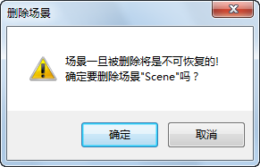

场景中涉及的基本操作包括打开场景、新建场景、删除场景、保存场景、另存场景、场景排序等等。

### 打开场景

　　“打开场景”命令，用来打开已保存的场景，并在新的场景窗口中显示。  
　　右键单击工作空间管理器中已保存的场景结点，在弹出的右键菜单中选择“ **打开场景** ”，就会将选中的场景显示在新的场景窗口中。

### 新建场景

　　“新建场景”命令，用来在当前工作空间中新建一个场景窗口，并且在场景集合中添加一个场景子结点，默认名称为“未命名场景”。  

SuperMap 提供了两种新建场景的方式，下面将分别介绍两种新建场景的方法。  
  * 单击功能区 > “ **开始** ”选项卡 > “ **浏览** ”组“ **场景** ”项的下拉箭头，在弹出的菜单中选择“ **新建球面场景窗口** ”或“ **新建平面场景窗口** ”。 
  * 右键单击工作空间管理器中的场景集合结点，在弹出的右键菜单中单击“ **新建平面场景** ”或“ **新建球面场景** ”。

### 删除场景

　　“删除场景”命令，用来将已保存的场景从工作空间的场景集合中删除。

操作步骤如下：

  1. 右键单击选中工作空间管理器中的场景结点，在弹出右键菜单中选择“ **删除场景** ”。
  2. 弹出如下图所示的提示对话框，询问用户是否真的删除选择的场景，单击对话框中的“确认”按钮，删除选中的场景。   
  

**注意事项**

- 按住 Ctrl 键，在工作空间管理器中先同时选中多个场景，然后再右键单击鼠标，在弹出的右键菜单中选择“删除场景”命令，可以实现一次删除多个选中的场景。
- 按 Delete 键也可以删除场景。

### 重命名场景

　　“重命名”命令，用来修改场景的名称。

**操作步骤**

  1. 右键单击选中工作空间管理器中的场景结点，在弹出右键菜单中单击“ **重命名** ”。
  2. 场景结点的显示名称变为可编辑状态，此时，键入新的场景名称。
  3. 修改名称后，在应用程序界面中任意位置单击鼠标，或者按下“回车键（Enter）”即可完成场景名称的修改。

**备注：** 按 F2 键也可以实现场景结点重命名。

### 保存场景

　　“保存场景”命令，用来保存当前场景窗口中场景的所有内容。

**操作步骤**

  1. 使当前场景窗口中没有选中的对象。
  2. 在场景窗口中右键单击鼠标，在弹出的右键菜单中选择“ **保存场景** ”命令，弹出“保存场景”对话框。
  3. 用户可修改系统默认的场景名称，单击“确认”按钮后，保存当前场景。
  4. 保存场景后，当前处理的场景为保存后的场景。同时，工作空间管理器中的场景集合结点下将增加这个新保存的场景结点。

### 另存场景

　　“场景另存为”命令，用来另存当前场景窗口中的场景的所有内容。

**操作步骤**

  1. 使当前场景窗口中没有选中的对象。
  2. 在场景窗口中右键单击鼠标，在弹出的右键菜单中选择“ **场景另存为** ”命令，弹出“场景另存为”对话框。
  3. 用户可修改系统默认的场景名称，单击“确认”按钮后，即可另存当前场景，单击“取消”按钮后，即可取消本次另存场景操作。
  4. 另存场景后，当前处理的场景为另存后的场景。同时，工作空间管理器中的场景集合结点下将增加这个另存的场景的结点。

### 场景排序

　　“按名称排序”命令，用来将场景集合结点下的所有场景结点按显示名称进行排序，从而便于浏览和查找场景。  
　　右键单击工作空间管理器中的场景集合结点，在弹出的右键菜单中选择“ **按名称排序** ”。

### 输出场景

　　“场景输出为图片”命令，用来将当前场景窗口中的场景输出为图片。支持的图片文件的格式包括：*.bmp、*.emf、*.jpg、*.png、*.gif、*.tif。

**操作步骤**

  1. 使当前场景窗口中没有选中的对象。
  2. 在场景窗口中右键单击鼠标，在弹出的右键菜单中选择“ **场景输出为图片** ”命令。
  3. 弹出“输出为图片”对话框，该对话框中显示了当前输出的图片的宽度和高度，用户可在该对话框中指定输出的图片的保存路径、文件名、文件格式。若需要自行定义分辨率，通过勾选“自定义分辨率”复选框，设置当前输出图片的分辨率。若选择输出为 *.png 格式，还可通过勾选“背景透明”复选框，设置输出的图片中球体外的部分是否透明显示。
  4. 设置完成后，单击“输出为图片”对话框中的“确定”按钮即可。

**相关主题：**

[对象选择风格](Scene_SelectStyle)  
[全局对象选择风格](ObjectSelectStyle)

