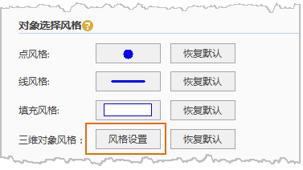

　　“全局对象选择风格”用来设置加载至场景中的图层中对象选中后的显示风格（统一风格）。

**操作步骤**

  1. 单击“文件”选项卡内的“选项”的“常用”选项卡中的“对象选择风格”内的“三维对象风格”后“风格设置”按钮，在弹出“三维对象选择风格”对话框中设置相应参数。
     
  2. 参数设置。
      * 在“三维对象选择风格”对话框中，单击“前景色”右侧下拉按钮，在弹出的颜色面板选择填充颜色。  
      * 在“三维对象选择风格”对话框中，单击“线颜色”右侧下拉按钮，在弹出的颜色面板选择填充颜色。   
      * 在“透明度”组合框中可以直接输入透明度值，或者单击该标签右侧的按钮，使用滑块来调整透明度。默认透明度的数值为 0，表示图层完全不透明，随着数值的增加图层会变得更透明；当透明度的数值设为100时，图层完全透明。透明度数值的范围为0至100之间的整数。  
      * 在“三维对象选择风格”对话框中，单击“颜色模式”右侧下拉按钮，选择“替换”或者“混合”模式。    
        - **替换** ：指将对象的颜色替换为前景色选择的颜色。  
        - **混合** ：指将对象颜色和前景色进行混合。

**注意事项**

  1. 全局对象选择风格设置的参数仅对参数设置后加载至场景中的图层有效，对在参数设置前已经加载至场景中的图层无效。
  2. 全局对象选择风格设置的参数适用于二维/三维点图层、二维/三维面图层、模型图层以及它们的缓存图层和专题图图层，还有OSGB图层。当上述图层处于图层分组下时也一样适用。当需要对某一图层的对象选择风格进行单独设置时可以通过右键菜单来实现，单个图层的对象选择风格的优先度高于全局选择对象风格。
  3. 全局对象选择风格参数设置单击确认后，将保存设置的参数。当再次启动软件时，上次设置的参数仍然有效。

**相关主题：**
 
[对象选择风格](Scene_SelectStyle.md)  
[OSGB图层右键菜单](../OSGB/OSGBLayerContextMenu.md)

