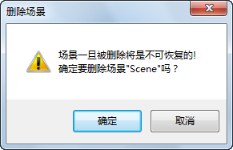

---
id: Scene_Del
title: 删除场景  
---  
### 使用说明

“删除场景”命令，用来将已保存的场景从工作空间的场景集合中删除。

### 操作步骤

  1. 右键单击选中工作空间管理器中的场景结点，在弹出右键菜单中选择“ **删除场景** ”。
  2. 弹出如下图所示的提示对话框，询问用户是否真的删除选择的场景，单击对话框中的“确认”按钮，删除选中的场景；单击“取消”按钮，则取消此次删除操作。     
  

### 注意事项

  1. 按住 Ctrl 键，在工作空间管理器中先同时选中多个场景，然后再右键单击鼠标，在弹出的右键菜单中选择“删除场景”命令，可以实现一次删除多个选中的场景。
  2. 按 Delete 键也可以删除场景。

