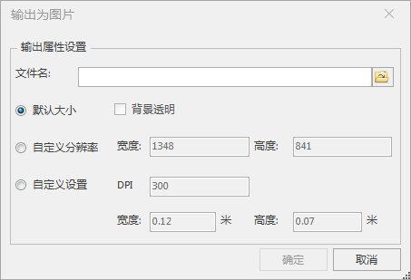

　　2.5维地图又称为假三维地图，是以三维地图数据为基础，按照一定的固定视角输出的影像数据，具有类型三维数据的显示效果，但其本质为二维图片，只能显示固定角度的三维模型效果，因此称为假三维。2.5维地图既具有三维地图的良好显示效果，又具备数据量小的优点，满足了在现有网络环境下对三维地图的快速浏览访问。常应用于手机和Web端的地图查询和导航等。   
“场景输出为图片”命令，用来将当前指定范围场景输出为影像数据。  

**操作步骤** 

  1. 在场景中打开需生成2.5维数据的三维数据，并保证当前场景窗口中没有选中的对象。
  2. 在场景窗口中单击鼠标右键，在弹出的右键菜单中选择“ **场景输出为图片** ”命令。
  3. 弹出“场景输出为图片”对话框，在对话框中可设置输出文件路径、分辨率和背景是否透明等相关参数，如下图所示：  
     
 
  5. 设置完成后，单击“场景输出为图片”对话框中的“确定”按钮，即可将相机范围内的三维数据生成为*.bmp或*.emf或*.或jpg*.png或*.gif或*.tif文件。
 
**备注**

 - 将影像数据导入SuperMap iDesktop中时，其坐标系默认与数据源坐标系一致。  

