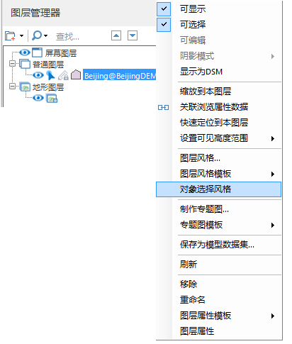

---
id: Scene_SelectStyle
title: 对象选择风格  
---  
### 使用说明

三维场景中“对象选择风格”命令，用来设置加载至场景中的某个图层中对象选中后的显示风格。

当需要对某一图层的对象选择风格进行单独设置时可以通过右键菜单来实现。支持的图层有二维/三维点图层、二维/三维面图层、模型图层以及它们的缓存图层和专题图图层，还有OSGB图层。当上述图层处于图层分组下时也一样适用。

### 操作步骤

  1. 以面数据集对象为例进行说明，在图层管理器中选中的二维面或三维图层，单击右键，在弹出右键菜单中选择“ **对象选择风格** ”命令。    
  
 
  2. 弹出“对象选择风格”对话框。
  3. 在“对象选择风格”对话框中，单击“前景色”右侧下拉按钮，在弹出的颜色面板选择填充颜色。
  4. 在“对象选择风格”对话框中，单击“线颜色”右侧下拉按钮，在弹出的颜色面板选择填充颜色。
  5. 在“对象选择风格”对话框中，单击“颜色模式”右侧下拉按钮，选择“替换”或者“混合”模式。
      * **替换** ：指将对象的颜色替换为前景色选择的颜色。
      * **混合** ：指将对象颜色和前景色进行混合。
  6. 在“透明度”组合框中可以直接输入透明度值，或者单击该标签右侧的下拉按钮，使用滑块来调整透明度。默认透明度的数值为 0，表示图层完全不透明，随着数值的增加图层会变得更透明；当透明度的数值设为100时，图层完全透明。透明度数值的范围为0至100之间的整数。
  7. 通过勾选"贴对象"复选框，设置面贴附于对象上。

###  注意事项

  1. 设置模型数据集对象选择风格时，可以通过勾选“显示包围盒”复选框，设置显示选中的模型对象的最小外接长方体。

