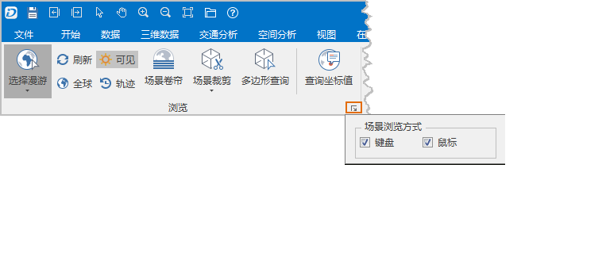

---
id: BrowseScene
title: 浏览场景  
---  
“ **场景** ”选项卡的“ **浏览** ”组，组织了在场景窗口浏览场景、选择对象、场景裁剪、场景卷帘、查询对象的坐标信息等功能。。

  

  
下面详细介绍“浏览”组中各个按钮的功能和操作步骤：

 [选择漫游](Pan3DButton)

 [刷新](Refresh3DButton)

 [全球](Restore3DButton)

[太阳特效](../../SceneOperation/AdvancedSceneSetting/SunEffect)

 [场景卷帘](../LayersManagement/SwipeTool)

 [Box裁剪](../LayersManagement/ClipByBox)

 [平面裁剪](../LayersManagement/ClipByFlat)

 [四边形裁剪](../LayersManagement/ClipByCross)

 [多边形查询](../LayersManagement/ClipByPolygon)

[查询坐标值](../LayersManagement/QueryCoordinateValues)

单击组对话框按钮，将弹出如下图所示的“场景浏览方式”组对话框，该对话框可用来控制场景中的浏览方式。    

  

  
“场景浏览方式”区域中的两个复选框用来控制场景中的浏览方式，包括两种场景浏览方式：通过鼠标操作执行相应的浏览操作，或通过键盘操作执行相应的浏览操作。

如果勾选复选框，则相应的浏览方式可用；否则，不可用。例如：如果取消了“鼠标”复选框的选中状态，则在场景所有通过鼠标操作完成的浏览动作都不可用。系统默认这两个复选框都为选中状态。

