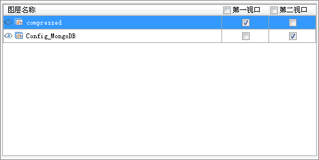
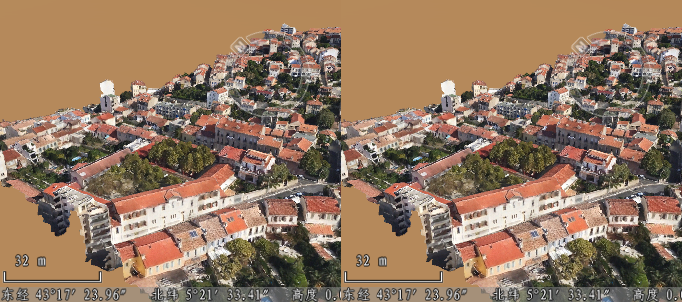

---
id: ViewportManage
title: 视口管理  
---  
### 使用说明

“视口管理”分组，用于管理同一个场景窗口的多视图模式，可以将一个场景中的多个图层分成多个视口分屏显示，同时实现了多个视口的关联浏览。

### 操作步骤

  1. 新建一个场景，将需进行分屏显示的数据集添加到同一个场景窗口中。
  2. 在“场景”选项卡中的“视口管理”组中，单击“视口模式”下拉按钮，在弹出的下拉选项中选择分屏显示的视口模式，应用程序提供了六种视口模式，即单视口、水平两视口、垂直两视口、三视口、水平三视口、四视口。
  3. 单击“视口设置”右侧的“视口图层设置…”按钮，在弹出的面板中设置每个视图窗口中需显示的图层，如下图所示：         
  

  4. 在当前场景窗口的图层列表中，在视口列中勾选图层复选框，设置每个视口需显示的图层，如上图所示。若勾选某视口前的复选框，则表示在该视口中显示当前场景中的所有图层。
  5. 设置好以上参数后，即可在场景中看到多视口显示的效果，如下图所示：         
  

  6. 设置多视口浏览场景之后，可在不同视口进行三维空间分析，且每个视口只显示当前视口的分析结果，多视口分析支持的功能有通视分析、可视域分析、动态可视域分析、日照分析、天际线分析。

### 备注

  * 在贴地模式下，线图层、面图层、栅格图层、影像图层、线或面生成的场景缓存(*.scv)图层、影像缓存(*.sci、*.sit)图层、地图缓存(*.sci)图层，在分屏显示时，其他窗口显示的图层与第一视口显示一致：
  * 地形图层不支持设置场景分屏显示。

  

