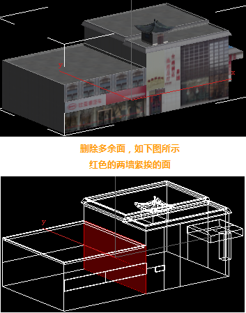
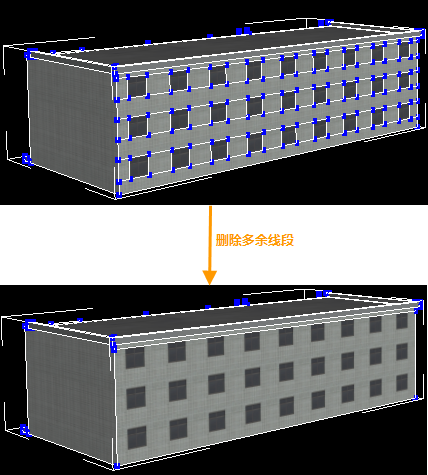
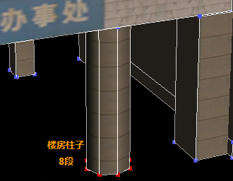
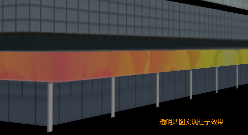
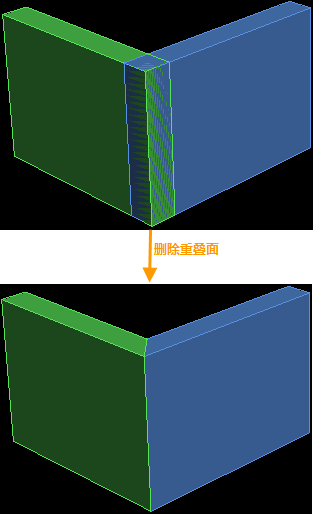

使用最少的面数表现出较好的结构。

  1. 删除没必要的面，例如，楼房的底面或两墙挨着的面，如下图所示：  
  
 
  2. 删除多余的线段、顶点和游离点，如下图所示，不要切出窗户上的线段，要用贴图表示：  
  
 
  3. 尽量减少曲面、圆柱体和球体的段数。   
     * 楼房比较大的柱子段数应该在8-12段；  
        
     * 小型的柱子段数应该在6-8段；
     * 比较小的柱子段数在6段以下，看情况而定，有的情况下可设置到最小的3段；
     * 在某一排上柱子比较多的话应该采用透明贴图来实现柱子的效果，如下图所示：  
  

  4. 同一法线两个面之间的最小间距要大于0.3米，以避免共面闪烁，例如广告牌。若两面间的距离必须小于0.3米，则为了避免共面闪烁，需要将下面的面挖洞。对于超过20米以上的大面在同一法线上重复的情况，最好将下面的面挖洞处理。  
  5. 避免重面，遇到重面现象时应该合理的删掉，如下图所示：  
  

  6. 能用贴图表现的模型尽量用贴图表现（也要看增加贴图换来的面数减少是否划算）。  
  7. 在模型制作完成后，需要取消全部冻结物体和隐藏物体、优化材质球、清空材质球、清空贴图目录，若有无用的冻结和隐藏物体，需要删除掉。

 

