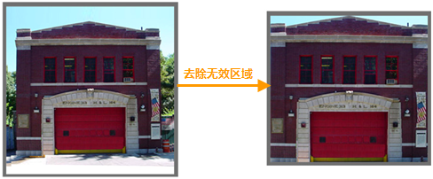
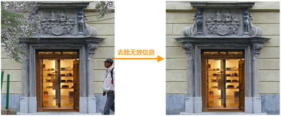
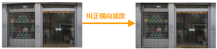
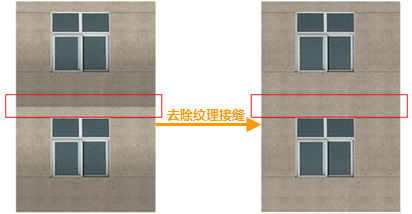
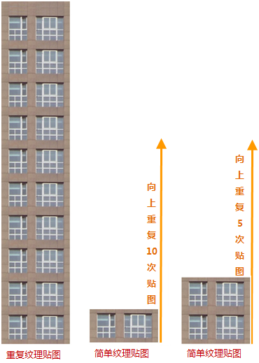
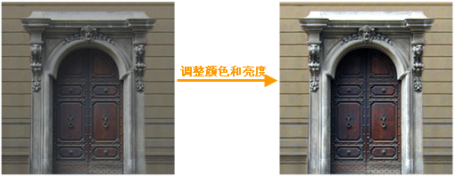

在进行纹理贴图前，需要进行以下检查与处理：

  1. 贴图纹理的尺寸要求为 2 的 N 次方，且最小不低于 2*2 像素，最大不要超过1024*1024像素。
  2. 贴图中不要出现无效区域及无效信息，如下图所示：  
  
  
  3. 贴图中不要出现带有弧度和角度不正的贴图，如下图所示：  
  

  4. 贴图中不要出现纹理接缝，如下图所示：  
  

  5. 不要出现纹理重复较多的贴图，例如对于10层的楼体贴图，最好使用1层的贴图重复10次，或者2层的贴图重复5次，如下图所示：  
  
 
  6. 贴图的颜色和亮度要调整到合适状态，保证贴图的清晰度和层次感，如下图所示：  
  
 
  7. 尽量减少透明贴图的使用。
  8. 使用贴图赋材质，而不要使用贴图颜色赋材质。

 

