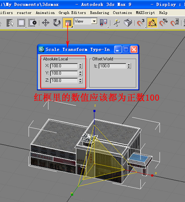

---
id: Attention8_3dModel
title: 坐标设置  
---  
在设置坐标的时候，需要注意以下4点：

  1. 设置坐标轴的位置。

坐标轴应该在建筑物的最底下，即 X 轴、Y 轴在建筑物的中心，Z 轴在建筑物的最小值最下面，Z 轴轴心所在的位置将是贴到地面的位置。

  
  2. 要把模型物体移动到场景坐标的原点上，即分别要放置在 X 轴、Y 轴以及 Z 轴的原点上。     
  3. 创建 Box 时，应该注意的坐标问题。 
    * 一定要在顶视图创建 Box，不要对 Box 做旋转、缩放操作，要使用对齐工具将 Box 与模型物体对齐，用轴心对齐轴心选项，如图所示：         
    * 塌陷 Box，用 Box 去 Attach 模型物体，然后进入面子集或元素子集把 Box 删掉，这样模型物体的属性都和 Box 一致。最终建筑物的坐标轴还是应该在建筑物 X 轴、Y 轴的中心，Z 轴的最下面。不要使用坐标轴移动命令（AffectPivotOnly）来移动坐标轴。
  4. 查看坐标属性。 
    * 选中模型物体，选择移动工具，在移动工具上单击右键弹出数值框，如图所示：      
   
    * 选中模型物体，选择旋转工具，在旋转工具上单击右键弹出数值框，如图所示：      
    
    * 选中模型物体，选择缩放工具，在缩放工具上单击右键弹出数值框，此时数值框的数值都应该为正数100，如图所示：      
     
    * 如果使用自身定义的坐标，选中模型，坐标轴必须是正的，如图所示：    
     
  

