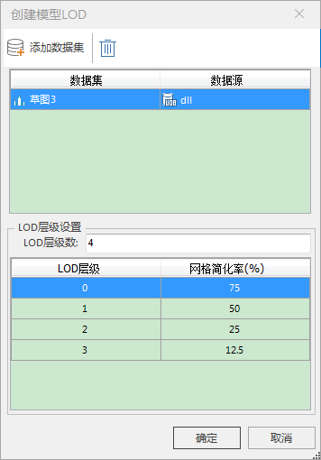

**使用说明**

平台支持单次或批量创建模型LOD。

**操作步骤**

  1. 在工作空间管理器中内的模型数据集结点单击鼠标右键选择“创建模型LOD...”，即弹出“创建模型LOD”对话框。  
   
  2. LOD层级设置：
       * LOD层级数：模型缓存显示时的LOD层级数。若设置为3，则产生0、1、2三个层级，其中第0层为精细层，第1层为次精细层，第3层为粗糙层。 
       * 网格简化率：表示模型显示的细节按照百分比进行简化。简化网格有利于合理地分配模型渲染的资源，达到高效率的场景显示。 
  3. 设置完毕，点击“确定”按钮将执行创建模型LOD操作。

 

