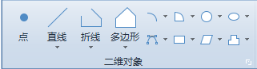
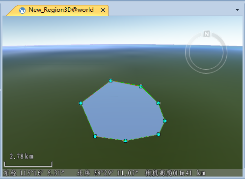

---
id: Create3DGeometry
title: 创建三维对象  
---  
在场景中可以创建三类对象，（1）场景中的二维对象，（2）场景中的三维对象，（3）粒子对象。

绘制三维对象或者粒子对象，只能在 CAD 模型数据集进行绘制。在绘制之前，请确保当前可编辑图层为 CAD 模型图层。

### 绘制二维对象

在场景中创建二维对象的方式与在地图中创建对象的方式一致。在场景中的图层，可编辑的情况下，可以绘制点、线、折线、多边形、曲线、圆、椭圆等多种几何对象。具体的绘制方法请参见[创建对象](../../DataProcessing/Objects/CreateObjects/CreateGeometry)。

  
二维对象  
  
### 绘制三维对象

目前支持在场景中绘制地标、三维点、折线和多边形等11种三维对象。三维对象的绘制直接绘制的方式。

为了保证绘制的三维对象看起来更直观，建议用户先修改当前场景的高度模式。在“ **风格设置** ”选项卡的“ **拉伸设置**
”组中，找到“高度模式”，通过右侧的下拉箭头，修改高度模式为非贴地模式，绝对高度或者相对地面，或者地下模式。在绝对高度或者相对地面模式下，可以捕捉场景中其他模型的节点。而在地下模式下，不方便捕捉其他模型的节点。

### 绘制粒子对象

粒子是一种用来模拟现实中的火焰、烟雾、喷泉、爆炸、降雨、降雪等特殊效果的最小对象。SueprMap 目前支持在场景中绘制粒子对象，且能在 CAD
数据集和KML文件中进行绘制，并通过一系列参数的设置，达到理想的粒子特效。粒子对象的绘制方法请参见[粒子对象的创建](../GeoParticle/GeoParticleSetting)。

### 操作步骤

下面以在场景中绘制多边形为例，介绍如何绘制三维对象。

  1. 在当前工作空间中，新建一个数据集，并将添加到新场景中。
  2. 在图层管理器中，单击三维面图层可编辑图标，使其处于可编辑状态。
  3. 在“ **对象绘制** ”选项卡的“ **三维对象** ”组中，单击组对话框按钮，单击“ **多边形** ”按钮，场景中出现绘制光标。
  4. 将鼠标移动到场景窗口中单击鼠标左键，确定多边形的起始位置。

如果当前场景中，存在模型数据，将鼠标移至模型上，勾选模型图层可捕捉，可捕捉模型节点位置，点击鼠标进行绘制。

  5. 继续绘制多边形上的其它线段。
  6. 单击鼠标右键，闭合多边形，结束当前绘制操作。

如下图所示，为绘制的的三维面对象。

   

