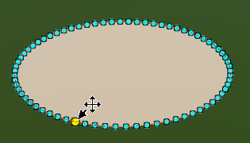
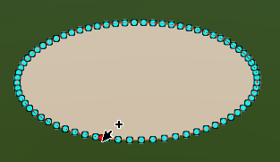
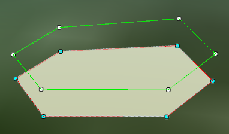
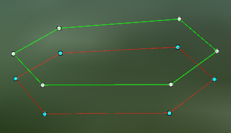
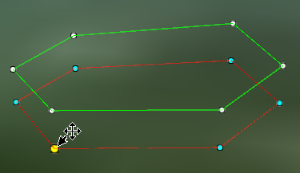
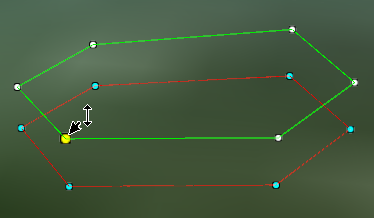
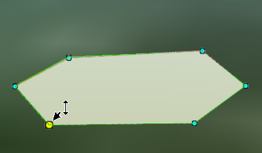

---
id: Edit3DNode
title: 面对象节点编辑  
---  
### 使用说明

场景中的图层为可编辑状态时，选中某个面对象后即可对其进行节点编辑，三维节点编辑功能适用于二维面数据集、CAD复合数据集、三维面数据集。

### 操作说明

**二维面对象节点编辑**

  1. 将矢量面数据集或CAD 数据集加载到场景中，并设置图层为可编辑状态。
  2. 在场景中选中需编辑节点的面对象，当前只能对一个选中的对象进行编辑节点的操作，节点编辑包括移动节点、删除节点、添加节点等操作。 
      * **移动节点** ：将鼠标放至面对象上的某个节点上，当节点颜色变为黄色时即已选中该节点，在选中的节点上按住鼠标左键不放，同时拖动鼠标，即可实现选中节点的移动，移动完成后，松开鼠标左键即可。以同样的方式进行其他节点的移动，移动节点后几何对象的形状会随之发生改变。
      * **删除节点** ：将鼠标放至面对象上的某个节点上选中该节点，按住 Shift+Delete 键即可将选中节点删除。
      * **添加节点** ：在选中面对象边界线上的任意位置处单击鼠标左键，即可在鼠标单击处添加一个新的节点。   
    

**三维面对象节点编辑**

  1. 将三维面数据集添加到场景中，并设置图层为可编辑状态。
  2. 在场景中选中需编辑节点的面对象，当前只能对一个选中的对象进行编辑节点的操作。三维面对象的节点编辑包括移动节点、删除节点、添加节点等操作。三维面对象由范围和高程两部分组成，其中绿色线框为高程面，红色线框为范围面，如下图所示：          
         
      * **移动范围面节点** ：将鼠标放至三维面对象的范围面某个节点上，当节点颜色变为黄色时即已选中该节点，在选中的节点上按住鼠标左键不放，同时拖动鼠标，即可实现选中节点的移动，移动完成后，松开鼠标左键即可。移动范围面节点后几何对象的形状会随之发生改变，高程面的范围也会随之改变。
      * **移动高程面节点** ：将鼠标放至三维面对象的高程面某个节点上，当节点颜色变为黄色时即已选中该节点，在选中的节点上按住鼠标左键不放，同时上下拖动鼠标，即可实现选中节点高程值的改动，移动完成后，松开鼠标左键即可。移动高程面节点后几何对象的高程值会随之改变。 

**注意** ：若高程面与范围面重合时，选中节点后，按住 Shift 键并同时移动鼠标可编辑面对象高程节点。

 |  |   
---|---|---  
移动范围面节点 | 移动高程面节点 | 重合时按Shift键移动高程面节点  
  * **删除节点** ：将鼠标放至面对象上的某个节点上选中该节点，按住 Shift+Delete 键即可将选中节点删除。
  * **添加节点** ：在选中面对象边界线上的任意位置处单击鼠标左键，即可在鼠标单击处添加一个新的节点。

###  注意事项

  选中面对象节点后，需同时按住 Shift+Delete 键删除节点；只按住 Delete 键，则会删除选中面对象。

