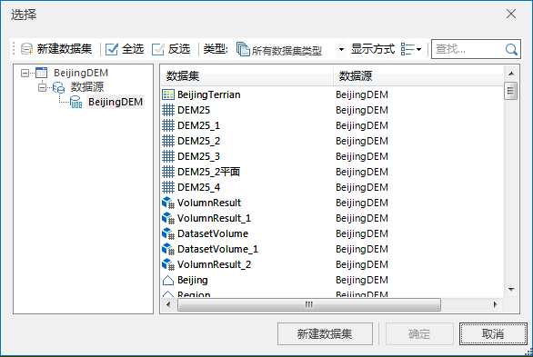
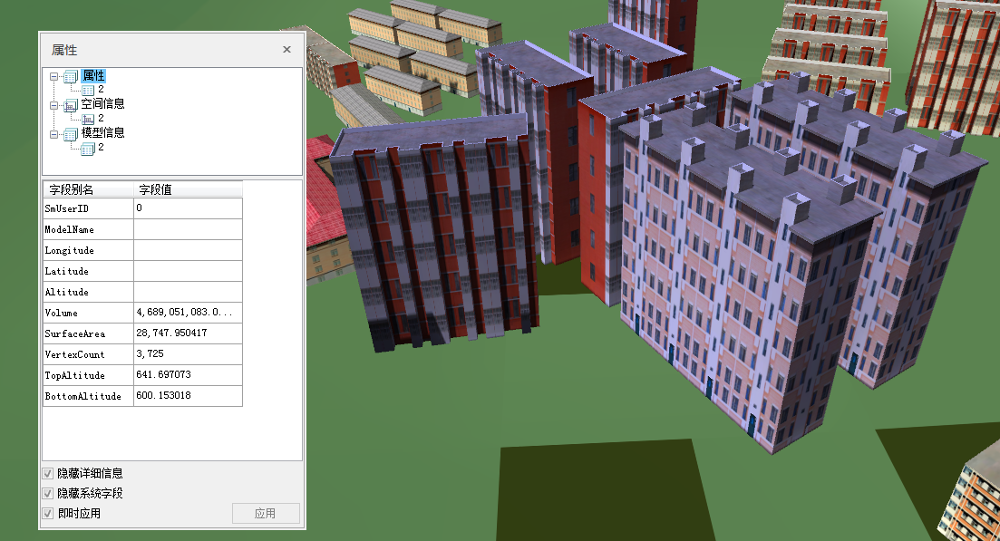

---
id: ExtractProperty
title: 模型属性提取  
---  
### 使用说明

提取模型数据集的相关属性，例如：体积、表面积、顶点数量、顶部高程及底部高程。

### 操作步骤

  1. 在工作空间管理器中，打开需要提取属性的模型所在的数据源。
  2. 在“ **三维数据** ”选项卡上“ **模型** ”组中，单击“ **属性提取** ”按钮，弹出“模型属性提取”对话框。
  3. 左键单击“添加数据集”按钮，在打开的“选择”界面上选择模型数据集。如下图所示：     
  
  
左边界框内显示了工作空间下的数据源，右边界框内显示对应数据源下的模型数据集。

可以选择需要提取属性的已有模型数据集，也可以选择左键单击面板工具栏中“新建数据集”按钮或者面板底部“新建数据集”按钮新建的模型数据集。单击“确定”按钮，将数据集添加到“模型属性提取”对话框中。

  4. 选择需要提取的属性，快速全选可勾选“序号”。在场景中查看模型对象的属性信息，如下图所示，提取了模型的体积、表面积、顶点数量、顶部高程和底部高程。
  

