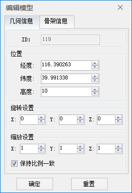
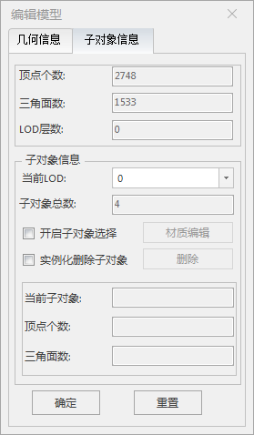
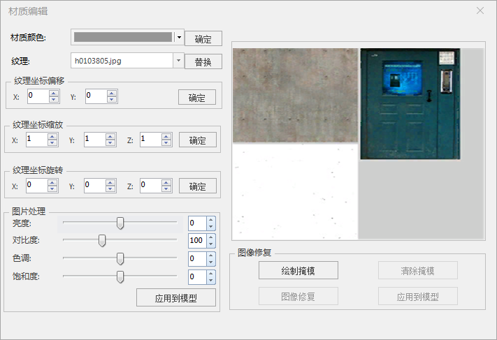

　　模型数据集图层不开启图层编辑时，支持对模型对象进行编辑，在场景中选中某一个模型对象，点击鼠标右键选择“编辑模型”选项弹出“编辑属性”对话框，即可更改模型的几何与骨架。

**编辑几何信息**

在“几何信息”窗口可对模型的位置、旋转、缩放进行设置，如下图所示：  
    
  * **位置：** 输入新的（经度/纬度/高度）数值即可更改此对象的空间位置，达到移动模型的目的。
  * **旋转设置：** 分别设置沿（X/Y/Z）轴的旋转角度。
  * **缩放设置：** 分别设置沿（X/Y/Z）轴放大或缩小的比例。
  * **保持比例一致：** 默认勾选，表示对模型进行缩放时，更改X/Y/Z值的任意一个，其它两个值将一起更改，确保缩放比例一致。

对模型对象的几何信息进行更改后，点击“确定”按钮即保存当前修改，并关闭“编辑模型”对话框；点击“重置”即撤销此次更改操作，恢复至编辑前的状态，重新对模型进行编辑。

**编辑子对象信息**

在“子对象信息”窗口主要可对模型的子对象进行选择与删除，如下图所示：  
  
 
  * **当前LOD：** 点击下拉选择框，可自定义选择模型的LOD层级。
  * **开启子对象选择：** 勾选该复选框，激活子对象选择功能，在场景中单击鼠标左键进行选择，选中某个子对象时，将显示被选中子对象的编号、顶点个数及三角面数。
  * **材质编辑** ：选中某个子对象后，单击该按钮，弹出“材质编辑”对话框。如下图所示。　　　
  
  
    * 材质颜色：单击下拉按钮在颜色面板中选择颜色值，选择完毕后，单击“确定”按钮实时应用到子对象。
    * 纹理：单击下拉按钮在数据源中选择纹理或者单击“替换”按钮，弹出打开面板，可以在对话框中选择文件类型为*.png,*.jpg,*.jpeg,*.bmp,*.gif的纹理，单击“打开”按钮即可完成纹理替换。
    * 纹理坐标偏移：分别设置沿（X/Y）轴偏移的大小。默认值为0。可通过单击X/Y右侧的上下箭头进行数值调节。上箭头为增大数值，下箭头为减小数值。单击一次的变动值为0.01.也可直接输入数值，进行实时浏览。还可选中数值框滚动鼠标滑轮，每次滚动的变动值为0.03。单击“确定”按钮实时应用到子对象。
    * 纹理坐标缩放：分别设置沿（X/Y/Z）轴放大或缩小的比例。默认值为1。可通过单击X/Y/Z右侧的上下箭头进行数值调节。上箭头为增大数值，下箭头为减小数值。单击一次的变动值为0.01.也可直接输入数值，进行实时浏览。还可选中数值框滚动鼠标滑轮，每次滚动的变动值为0.03。单击“确定”按钮实时应用到子对象。
    * 纹理坐标旋转：分别设置沿（X/Y/Z）轴的旋转角度。默认值为0。可通过单击X/Y/Z右侧的上下箭头进行数值调节。上箭头为增大数值，下箭头为减小数值。单击一次的变动值为0.01.也可直接输入数值，进行实时浏览。还可选中数值框滚动鼠标滑轮，每次滚动的变动值为0.03。单击“确定”按钮实时应用到子对象。
    * 图片处理：分别改变亮度、对比度、色调、饱和度来调整子对象的显示效果。单击“应用到模型”按钮实时应用到子对象并在面板右侧实时浏览显示效果。
    * 图像修复：通过绘制掩膜、清除掩膜、图像修复、应用到模型等按钮实现图像修复。
  * **实例化删除子对象** ：勾选“实例化删除子对象”复选框，单击“删除”按钮即删除当前被选中的子对象中的相同骨架的对象。
  * **删除：** 单击“删除”按钮即删除当前被选中的子对象。

　　对模型对象的骨架进行更改后，点击“确定”按钮即保存当前修改，并关闭“编辑模型”对话框；点击“重置”即撤销此次更改操作，恢复至编辑前的状态，重新对模型进行编辑。

 

