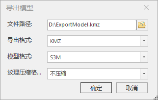
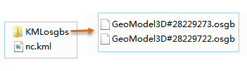
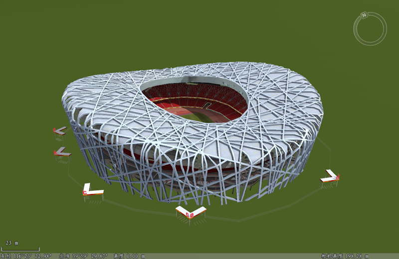

**使用说明**  
　　平台支持将模型数据集中的任意一个或多个模型导出为OSGB、KMZ、KML、S3M、OFF、STL、GLTF、DAE和S3MB文件保存。

**操作步骤**

  1. 在场景中单击鼠标左键选择模型对象，鼠标右键选择“导出模型”选项，即弹出“导出模型”对话框，如下图所示：  
    
  2. 对导出格式、保存文件路径、模型格式进行设置：
      * 导出格式：用于设置导出数据的格式。下拉选择导出格式，支持导出为OSGB、KMZ、KML、S3M、OFF、STL、GLTF、DAE及S3MB格式的模型。
        - OSGB格式：仅导出OSGB模型文件。
        * KMZ格式：将导出记录模型参数的KMZ文件，模型格式选项可用。
        * KML格式：将导出记录模型参数的KML文件，模型格式选项可用。
        * S3M格式：导出模型存储为S3M文件。
        * OFF格式：导出模型存储为OFF文件。
        * STL格式：导出模型存储为STL文件。
        * GLTF格式：导出模型存储为GLTF文件。
        * DAE格式：导出模型存储为DAE文件。
        * S3MB格式：导出模型存储为S3MB文件。
     * 文件路径：用于设置导出数据的保存路径。单击右侧按钮，在弹出的“打开”对话框中设置数据保存路径与文件名称，单击“确定”按钮；也可在文本框中直接输入文件夹路径与名称。
     * 模型格式：当导出格式选择为KMZ或KML时，模型格式选项可用，包括S3M、OSGB、GLTF、DAE这4种选项。
  3. 设置完毕，点击“确定”按钮将执行导出模型操作。  
　　导出成功后，在指定路径下生成了指定的KML文件，若选择“KML”导出格式以及“OSGB”模型格式，将在存放KML文件的目录下创建一个“KMLosgbs”文件夹，此文件夹存放了模型对象的模型数据，即*.osgb文件。    
     
　　由于KML文件记录了osgb模型文件的相对路径，在三维场景中添加此KML文件，将显示模型对象。  
  
  
**注意事项**

  * 在场景中通过鼠标左键选择模型对象时，可配合键盘“shift”键实现选中多个模型对象，这样可一次导出多个模型。
  * 导出时场景中选择了几个模型文件，将导出相应个数的模型文件。

 

