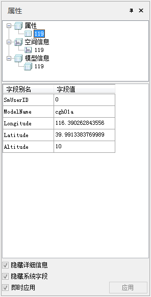
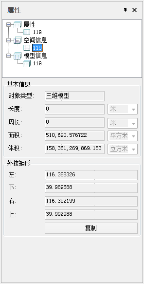
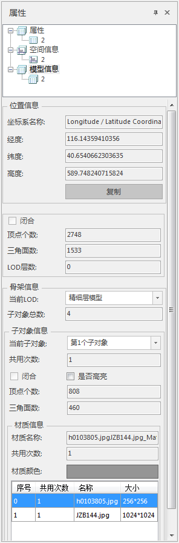

　　当场景中有选中的模型数据集图层中某个对象时，单击鼠标右键，在弹出的右键菜单中选择“属性”命令，即可弹出“属性”面板。“属性”面板中显示的是选中模型对象的详细属性信息。  
　　“属性”窗口的顶部为一个树状结构的目录，目录树显示了属性信息的类别，包括“属性”、“空间信息”、“模型信息”，这些节点的下一级为选中对象的 SmID 值。  
　　单击目录树中的某个节点，“属性”窗口的底部将显示该对象具体的信息内容。下面详细介绍各类信息的具体内容：

**属性**

　　单击“属性”对话框顶部目录树中的“属性”节点的下一级节点，即选中对象的SmID号，对话框底部区域将单独显示SmID 对应对象的属性信息，如下图所示。  
  
  * **隐藏详细信息：** 该复选框用于设置是否显示或隐藏详细信息字段。默认为勾选，表示将隐藏其它字段的属性信息，仅显示字段别名和字段值两个字段。取消勾选，将增加显示字段名称、字段类型、是否必填的字段信息。
  * **隐藏系统字段：** 该复选框用于设置是否显示或隐藏系统字段的属性信息。默认为勾选，表示隐藏所有系统字段的属性信息，避免由于系统字段太多时无法清楚查看非系统字段的属性信息。取消勾选，将显示所有系统字段的信息。

**空间信息**

　　单击“属性”对话框顶部目录树中的“空间信息”节点的下一级节点，即选中对象的SmID号，对话框底部区域将单独显示SmID对应对象的空间信息，主要包括基本信息与外接矩形范围如下图所示。

  

**模型信息**

　　单击“属性”对话框顶部目录树中的“模型信息”节点的下一级节点，即选中对象的SmID号，对话框底部区域将单独显示SmID对应对象的模型信息，模型信息节点详细列出了如下图的模型结构信息：  
  

目前支持对以下信息进行更改选择或对模型进行编辑操作。

  * **当前LOD：** 点击下拉选择框，可自定义选择模型的LOD层级；
  * **当前子对象：** 点击下拉选择框，可自定选择当前被选中的子对象，勾选“是否高亮”选择框，将以红色高亮突出被选中的子对象。
  * **是否高亮：** 是否高亮显示当前被选中的子对象，若勾选，将红色高亮显示选中子对象。

 

